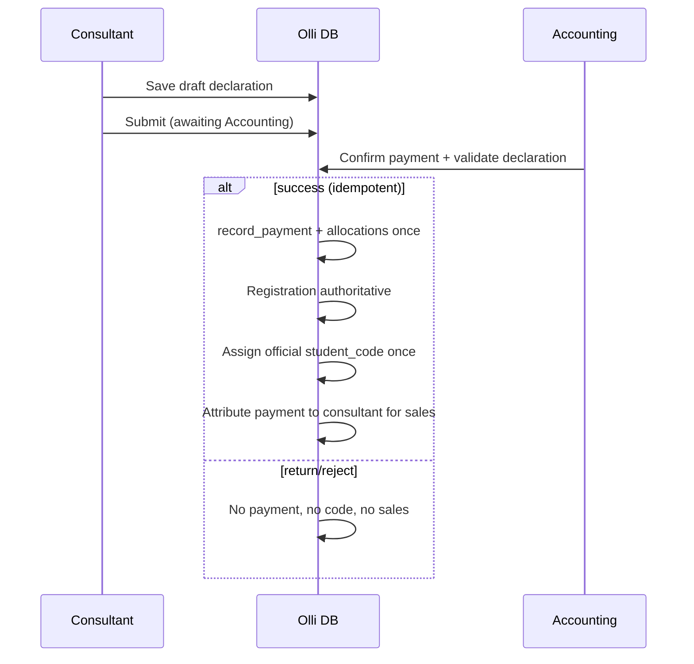

# Consultant Workspace V2 — T01 Design Contract

**Status:** **CLOSED / PASS** — canonical design gate (implementation not started)  
**Baseline:** `c2d2d3d28fbb7d0e47581792e887139fea6ca2e0`

This document is the build contract for post-T01 tasks. It preserves M1–M8 authoritative domains and forbids second sources of truth.

### Semantic triad (locked)

| Label | Role |
|-------|------|
| **Consultant declaration** | Intake / workflow (`draft`, submitted, returned, rejected); **not** sales |
| **Consultant sales (`Doanh số tháng`)** | **Accounting-confirmed payment/cash** attributable to the consultant |
| **Accounting revenue** | Existing M2 **`revenue_recognition_event`** — independent timing from consultant sales |

---

## 1. UX contract

### 1.1 Primary surface

- **Route (proposed):** `/crm/workspace` (or replace `/crm/my-work` after migration period).
- **Audience:** users with `lead.read` + new scoped workspace permissions.
- **Layout:**
  - **Header:** month navigator + **Doanh số tháng** (single figure, VND formatting via existing finance formatters).
  - **Body:** single grid default columns (STT, họ, tên, mã, trạng thái, phụ huynh, phone, học phí action, chi tiết, lưu/sửa).

### 1.2 Interaction model

- **Default sort:** newest first (`workspace_sequence DESC` or `portfolio_entered_at DESC`).
- **Edit:** click cell → type → Enter/Tab → next cell (spreadsheet semantics).
- **Status column:** read-only, derived.
- **Student code column:** read-only; provisional display allowed.
- **Row hide:** hides from consultant view only; restore from grid menu.
- **Mobile:** card fallback for &lt; lg; full grid desktop-first; keyboard model desktop-primary.

### 1.3 Chi tiết (details)

- Opens **existing** student operational surfaces in a **side panel or deep link**, not a duplicate profile.
- **Pre-conversion:** lead detail `/crm/leads/[id]` (existing).
- **Post-conversion:** hub link **`/students/[id]/enrollments`** (canonical operational entry today); guardians via `/students/[id]/guardians`.
- Requires **scoped read** permission — consultants must not gain full Academic Ops student admin.

### 1.4 Payment side panel

- Trigger from tuition cell (`Đóng phí`, `Chờ xác nhận`, `Cọc phí`, `Một phần`, `Full phí`).
- **Right drawer** fields: học viên, khóa học (select authoritative `course`), tổng phải nộp, số tiền lần này, còn thiếu (live calc), ưu đãi/ghi chú.
- Actions: **Hủy**, **Lưu nháp**, **Gửi xác nhận** (submit for accounting — never label submit as final “Lưu”).

---

## 2. Unified read model (conceptual)

### 2.1 Row identity

Each grid row is a **portfolio subject**, not a single table:

```text
subject_type: 'lead' | 'student'
subject_id: uuid
consultant_user_id: uuid (owner)
portfolio_entered_at: timestamptz
workspace_sequence: bigint  -- STT source
```

- **Lead rows:** open leads assigned to consultant (and optionally leads created by consultant — policy: **assigned_user_id = current user** for V1).
- **Student rows:** students linked from converted leads where consultant attribution matches (use `lead_conversion.assigned_user_id` snapshot + active assignments).

**No** merged table replacing `lead` or `student`.

### 2.2 RPC contract (future)

`list_consultant_workspace_grid(p_cursor, p_limit, p_filters jsonb)`:

- SECURITY INVOKER, `_assert_consultant_crm_personal_access()`, enforce consultant scope.
- Returns flat DTO for grid + `updated_at` tokens per editable segment.

---

## 3. Source-of-truth map (locked)

| Field | Authority |
|-------|-----------|
| STT | `consultant_portfolio_entry.workspace_sequence` |
| Names | `lead_candidate` / `student` canonical columns |
| Uppercase display | UI transform on read/edit blur (preserve stored casing optionally normalized to uppercase on save for consultant-entered prospects only — **prefer display transform** for converted students to avoid destroying Academic edits) |
| Student code (official) | `student.student_code` set only by allocator RPC |
| Student code (provisional) | Computed: `consultant_code || birth_year_2d || '0000'` — **not persisted** |
| Status (4 UX) | SQL/TS function `derive_consultant_workspace_status(subject)` |
| Guardian / phone | Primary contact resolution (lead contact vs `student_guardian`) |
| Course | Enrollment → class → course, else lead candidate target course |
| Total tuition | Active `enrollment_financial_terms.net_tuition_amount` |
| Paid (confirmed) | Sum allocations on posted payments for enrollment charges |
| Remaining | Sum `charge_balance.outstanding_balance` for enrollment |
| Tuition cell label | `derive_tuition_payment_display(enrollment_id)` |
| Monthly sales (`Doanh số tháng`) | Sum **posted** payment/allocation amounts in month with **consultant attribution** — see §7 (**not** declaration approvals) |
| Custom columns | EAV values keyed by `(consultant_user_id, subject_type, subject_id, field_def_id)` |

---

## 4. Student code contract

### 4.1 Format

`CCYYNNNN` (8 chars):

- `CC`: consultant staff code **at official allocation** (`01` = primary owner/center manager; `02`–`99` consultants). Frozen in the code after allocation even if assignment changes later.
- `YY`: last two digits of birth year **at official allocation** (from `date_of_birth`; if missing, use `00` and flag data quality — **block official assignment until DOB set**). Frozen after allocation; do not silently regenerate official code for DOB corrections without a future explicit admin workflow.
- `NNNN`: **center-wide** official student sequence for the organization — `0001`–`9999`, monotonic per org. **Independent of `CC` and `YY` for allocation purposes** (they are concatenated into the visible code after the next org sequence is taken).

### 4.2 Provisional (Tiềm năng)

- Display `NNNN = 0000` (official center sequence **not yet allocated**).
- **Do not persist** provisional codes in `student.student_code`.
- Multiple rows may show identical provisional codes (e.g. several `02170000`).

### 4.3 Official assignment event (locked)

**Trigger:** Accounting **confirms actual payment** in the composed confirmation workflow (after consultant declaration draft/submit).

**Canonical sequence:**

```text
Tiềm năng (display 02170000)
  → declaration draft | submit
  → awaiting Accounting
  → confirm payment (M2 posted cash)
  → registration authoritative
  → allocate next org-wide sequence (e.g. 0037) → official code 02170037
  → UX Ghi danh
```

**Effects (single idempotent composition — keyed by declaration id + idempotency keys):**

1. **`record_payment()` + allocations** exactly once (Accounting).
2. **Registration** authoritative (compose future RPC; may wrap `convert_lead()` — do not alter `convert_lead()` until implementation task).
3. Allocate next **`NNNN`** from **organization-only** counter (`0001`–`9999`, serialized `FOR UPDATE` on org row).
4. Compose immutable `student_code = CC + YY + NNNN` and persist once (immutable trigger guard).
5. M2 terms/charges as required by existing finance rules.

**Allocation examples** (center already at sequence `0036`):

| Next `NNNN` | CC | YY | Official code |
|-------------|----|----|---------------|
| 0037 | 02 | 17 | `02170037` |
| 0038 | 05 | 15 | `05150038` |
| 0039 | 02 | 18 | `02180039` |

**Must not occur on retry/concurrency:** double payment, double registration, two codes for one student, one code for two students, double consultant sales attribution.

### 4.4 Immutability

After official assignment, the entire **`CCYYNNNN`** string is immutable (e.g. `02170037` unchanged through lifecycle, class changes, consultant reassignment, or consultant account suspension). Deny updates to `student_code` except a future explicit administrative correction workflow (out of scope V2).

`CC` = consultant attribution **at allocation**; `YY` = birth-year component **at allocation**; `NNNN` = center-wide sequence **at allocation**.

### 4.5 Consultant codes

New table or columns, e.g. `staff_operational_profile (app_user_id, consultant_code char(2))` seeded at provisioning; Owner = `01`.

### 4.6 Exhaustion (fail closed)

When the **organization** has allocated **`9999`** official center sequences and the next allocation would exceed that:

- **Do not** allocate another official code.
- **Do not** roll over to `0001`, reuse an old sequence, or change the 8-character format.
- Return a **deterministic administrative error** (`student_code_namespace_exhausted` or equivalent) for operator resolution.

A future product version may define an expanded namespace if customer scale requires it.

Provisional **`CCYY0000`** may repeat; it is not an official code and is never stored in `student.student_code`.

### 4.7 CW2-T03 allocator requirement (documentation)

Implement a **concurrency-safe, transactional** organization-scoped counter (conceptually `student_sequence_counter(organization_id, next_sequence)` or safest equivalent). Two simultaneous Accounting confirmations in the same center must receive different values (e.g. A → `0037`, B → `0038`, never both `0037`). Exact schema/RPC belongs to CW2-T03 — not implemented in T01/T01.1.

---

## 5. Visible status mapping (deterministic)

Priority-ordered evaluation for each portfolio subject:

```text
IF student.status = 'graduated' → Tốt nghiệp
ELSE IF student.status = 'active'
     AND EXISTS enrollment.status = 'active' → Đang học
ELSE IF official student_code IS NOT NULL
     AND registration composition complete (post Accounting payment confirmation)
     → Ghi danh
ELSE → Tiềm năng
```

**Lead-only subjects** (no student yet): always **Tiềm năng** (provisional code display only).

**Withdrawn/inactive students:** hide from consultant grid when not attributed (recommended default).

Consultant **cannot** PATCH status.

---

## 6. Tuition payment display contract

| Label | Condition |
|-------|-----------|
| **Đóng phí** | No declaration draft/pending for primary enrollment obligation **and** outstanding &gt; 0 **and** no posted payment yet |
| **Chờ xác nhận** | Exists declaration `pending` (or submitted) for this enrollment/student |
| **Cọc phí** | Deposit schedule on active terms **and** allocations &gt; 0 **and** outstanding &gt; 0 |
| **Một phần** | `charge.status = partially_paid` (or outstanding &lt; net and allocations &gt; 0) **and not** deposit-mode |
| **Full phí** | All enrollment charges paid (`outstanding = 0` for obligation set) |

When **Full phí**, disable new declaration unless new charge/obigation exists.

**Còn thiếu (panel):** `net_obligation - sum_confirmed_allocations` where confirmed = posted payment allocations only.

---

## 7. Payment declaration & accounting workflow

### 7.1 Extend existing declaration domain (preferred)

Extend `consultant_revenue_declaration` (or rename in migration with backward compat view):

| Column (proposed) | Purpose |
|-------------------|---------|
| `student_id` | Target learner |
| `enrollment_id` | Optional until enrollment exists |
| `course_id` | Selected course |
| `total_obligation_amount` | Snapshot at submit |
| `status` includes `draft` | Draft saves |
| `submitted_at` | When consultant sends |
| `idempotency_key` | Double-submit guard |

Evolve review/confirm into a **composed Accounting confirmation** RPC (may supersede approve-only semantics for student-scoped declarations) while preserving audit trail.

### 7.2 Flow



### 7.3 Monthly sales header (locked)

**`Doanh số tháng`** = sum of **Accounting-confirmed payment/cash** attributable to the current consultant in the selected calendar month (org timezone via `resolve_reporting_period`).

- **Include:** posted `payment` amounts and/or `payment_allocation` amounts linked through **authoritative attribution** (implementation: payment row, allocation line, or declaration→payment bridge — **amounts live only in M2**).
- **Exclude:** pending/returned/rejected/`draft` declarations; **exclude** approved-but-unpaid declarations; **exclude** `revenue_recognition_event` unless explicitly building a different accountant KPI (not this header).

**Rejected design:** SUM(`declared_amount`) WHERE declaration `status = approved`.

---

## 8. Field editability matrix

| Field | Tiềm năng (lead) | Ghi danh | Đang học | Tốt nghiệp | Role |
|-------|------------------|----------|----------|-------------|------|
| Họ / tên (prospect) | B | C | C | A | Consultant |
| Họ / tên (student) | — | C | C | A | Consultant scoped |
| Student code | A | A | A | A | System |
| UX status | A | A | A | A | Derived |
| Guardian phone | B | B | B | B | Consultant / Ops |
| Canonical course/enrollment | A | B | B | A | System / Ops |
| Financial amounts | A | A | A | A | Finance |
| Custom columns | C | C | C | C | Owning consultant |

**Legend:** A = immutable/system · B = controlled editable (audit) · C = personal/custom editable

Inline edit allowed only where matrix = C or B with permission.

---

## 9. Guardians

- **Display:** primary contact only in grid (`formatPersonName` + relationship i18n + phone).
- **Max 2 guardians:** enforce in **consultant workspace workflow** + conversion wizard; optional future DB trigger — **do not break** existing &gt;2 links.
- Second guardian: student guardians page (scoped read).

---

## 10. Custom fields strategy (locked recommendation)

- **Definitions:** `consultant_custom_field_definition (org, owner_user_id, key, label, data_type, sort_order)`.
- **Values:** `consultant_custom_field_value (def_id, subject_type, subject_id, value_text)`.
- RLS: owner can CRUD own defs/values; managers cannot see private consultant columns.
- Keys must not collide with system DTO fields (`student_code`, `status`, …).

---

## 11. Grid preferences & hidden rows

- `consultant_grid_preference (user_id, jsonb)` — column order, width, visibility, pins.
- `consultant_grid_hidden_row (user_id, subject_type, subject_id)` — view-only hide.

---

## 12. RBAC contract

| Role | Workspace | Declare / draft | Review | Record payment |
|------|-----------|-----------------|--------|----------------|
| Consultant | Yes | Yes | No | No |
| Accounting | No primary grid | No | Yes | Yes |
| Center Manager | Optional exec view | No | Yes | Yes |
| Academic Ops | Students module | No | No | Terms/charges per existing |

New permissions (names illustrative):

- `consultant_workspace.read`
- `consultant_workspace.update`
- `consultant_custom_field.manage`

Do not grant blanket `student.read` to consultants.

---

## 13. Grid architecture recommendation

**Adopt TanStack Table v8 + TanStack Virtual** in a client component island inside Next.js server page shell:

- Server fetches page/cursor; client handles keyboard + virtualized body.
- Controlled editors per cell type; commit via Server Actions or RPC on blur/Enter.
- Column resize/visibility: table state persisted to `consultant_grid_preference`.
- Accessibility: roving tabindex, `aria-sort`, announce edits — target WCAG 2.1 AA for grid operations.

**Rejected for V2:** building full Excel clone in raw `<table>`.

---

## 14. Name presentation

- Split columns map to **`family_name`** (họ và tên đệm) and **`given_name`** (tên) — align Vietnamese labels in `messages/vi.json`.
- **Uppercase:** apply `toLocaleUpperCase('vi')` at display and on consultant-initiated saves for prospect rows; for converted students prefer **display-only** uppercase unless user explicitly edits.

---

## 15. Non-goals (T01)

- Replacing `/crm/leads` manager views for Center Manager.
- Changing M2 revenue recognition rules.
- Installing grid libraries (T01).
- Counting declaration approval toward **Doanh số tháng** (sales = confirmed payment only).
- Silent student-code reuse after `9999` or format changes.
