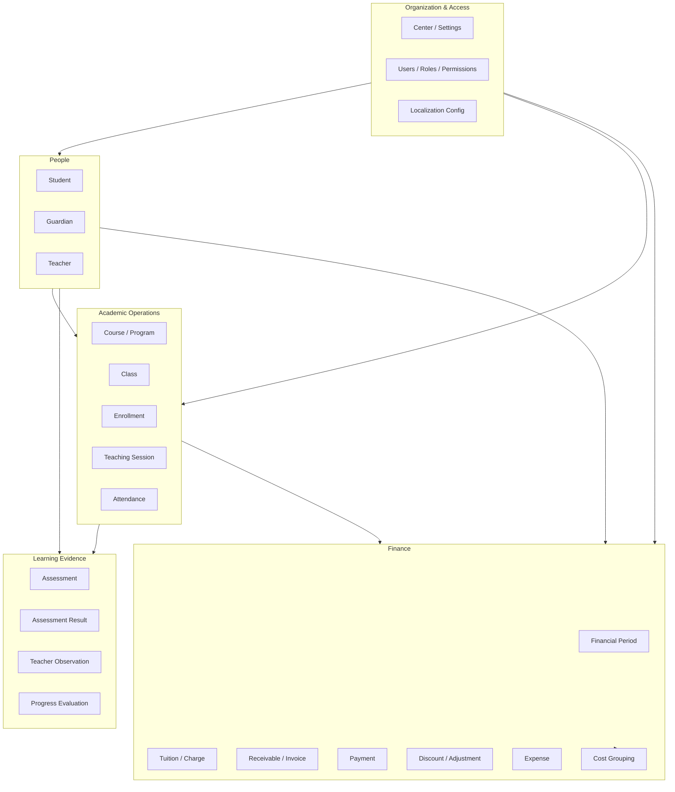

# M0-T01 — Domain Map

**Date:** 2026-09-14

This document defines the **canonical domain boundaries** for Olli. Domains are logical groupings for modelling and ownership — not necessarily separate microservices or database schemas in M0.

---

## Domain Overview

---

## Domain Definitions

### 1. Organization & Access

**Responsibility:** Center identity, operational settings, authenticated users, authorization, and locale preferences.

| Concern | Owned concepts |
|---------|----------------|
| Center configuration | Legal name, contact, timezone, currency, academic calendar defaults |
| Identity & access | User accounts, roles, permissions, user–role assignments |
| Localization settings | Default locale, supported locales (vi, en), user locale preference |

**Boundaries:** Does not own business transactions. Provides context for all other domains.

**Connects to:** All domains (every record is scoped to a center; every UI action is authorized).

---

### 2. People

**Responsibility:** Human actors and relationships relevant to operations — not login accounts (those live in Organization & Access).

| Entity | Responsibility |
|--------|----------------|
| **Student** | Learner profile, lifecycle status, contact/link to guardians |
| **Guardian** | Parent/guardian profile, relationship to students, billing contact |
| **Teacher** | Instructor profile, employment/contract reference, link to User optional |
| **Staff** | Non-teacher staff (via User + Role; no separate Staff master unless needed later) |

**Boundaries:** People domain stores **identity and relationships**, not grades, payments, or schedules directly.

**Connects to:**
- Academic Operations (enrollments, sessions, attendance)
- Learning Evidence (assessments, observations)
- Finance (payer/guardian on receivables, teacher on direct costs)

---

### 3. Academic Operations

**Responsibility:** What is taught, when, to whom, and whether students attended.

| Entity | Responsibility |
|--------|----------------|
| **Course / Program** | Catalog definition (level, curriculum code, default duration) |
| **Class** | Running instance of a course (schedule pattern, capacity, term) |
| **Enrollment** | Student placed in a class for a period with lifecycle status |
| **Teaching Session** | A scheduled or actual teaching occurrence |
| **Attendance** | Per-student presence/absence for a session |

**Boundaries:** Does not store lesson content, homework, or exam questions. Sessions are **operational events**, not LMS modules.

**Connects to:**
- People (student, teacher assignments)
- Learning Evidence (assessments tied to class/period)
- Finance (enrollment triggers tuition charges)

---

### 4. Learning Evidence

**Responsibility:** Management records that describe **service quality and student progress**.

| Entity | Responsibility |
|--------|----------------|
| **Assessment** | Defined evaluation event or rubric reference (type, class, date, max score) |
| **Assessment Result** | Score/outcome per student for an assessment |
| **Teacher Observation** | Qualitative record (concentration, engagement, participation, comments) |
| **Progress Evaluation** | Periodic summary of improvement/level relative to expectations |

**Boundaries:** Evidence is **entered by teachers/staff**, not generated by automated grading or student interaction in-app.

**Connects to:**
- Academic Operations (class, enrollment, session context)
- People (student, teacher)
- Reporting (quality indicators — computed from evidence + enrollment)

---

### 5. Finance

**Responsibility:** Monetary flows — revenue (tuition), receivables, payments, and costs — with **structured cost grouping**.

| Entity | Responsibility |
|--------|----------------|
| **Financial Period** | Reporting window (month, term, fiscal year) |
| **Tuition / Charge** | Amount owed for a service (linked to enrollment or fee rule) |
| **Receivable / Invoice** | Bill presented to guardian/payer |
| **Payment** | Money received |
| **Discount / Adjustment** | Reductions or corrections with reason |
| **Expense** | Money spent |
| **Expense Category** | Classification under a cost group |
| **Cost Group** | Top-level cost structure (**Cost B: exactly two groups**) |

**Boundaries:** Finance does not flatten all costs into ungrouped labels. Cost B structure is mandatory.

**Connects to:**
- People (guardian payer, student, teacher for direct costs)
- Academic Operations (enrollment → charges; class → teacher cost allocation)
- Organization (currency, period settings)

---

### 6. Reporting & Analytics (Derived — Not a Storage Domain in M0)

**Responsibility:** Computed views for management — **not** a separate canonical data store in M0.

Examples (all **calculated** from source domains):
- Revenue by period, class, or program  
- Outstanding receivables aging  
- Cost by Cost B group and category  
- Attendance rate by class  
- Average assessment scores / progress trends  
- Teacher cost per teaching hour (when inputs exist)

**Rule:** Do not persist dashboard aggregates when they can be computed from canonical records. Materialized caches may be added later with explicit refresh rules.

---

## Cross-Domain Integration Points

| Integration | Purpose |
|-------------|---------|
| Enrollment → Charge | Links academic commitment to revenue |
| Teaching Session → Attendance → Quality metrics | Links delivery to service quality |
| Teacher + Session + Expense | Links direct costs to academic delivery |
| Student + Guardian + Receivable | Links billing to payer |
| Assessment Result + Enrollment | Links outcomes to enrolled cohort |

These integrations are why **Business Performance** and **Learning / Service Quality** must share a coherent entity model rather than isolated silos.

---

## Domain Ownership Rules

1. Each entity has **one primary domain** (see [04-entity-inventory.md](./04-entity-inventory.md)).  
2. Cross-domain references use **foreign keys to stable IDs**, not duplicated denormalized names.  
3. Display names for people, categories, and statuses are **localized at presentation** — not stored as domain identifiers.  
4. Historical records in one domain must not be rewritten when master data in another domain changes.
