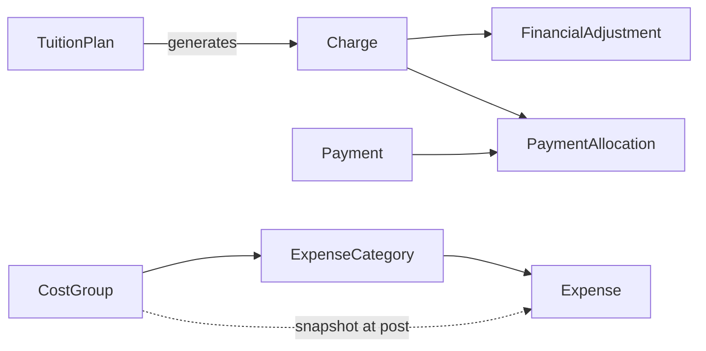

# M0-T02 — Finance Model

**Date:** 2026-09-14

This document records the canonical finance model decisions for Olli M0, including explicit rejection of duplicate debt entities from the M0-T01 preliminary inventory.

---

## Design Goal

Support operational finance for a language center:

- Record what is owed, paid, adjusted, and spent
- Support partial payments and multi-charge payments
- Preserve explainable transaction history
- Connect revenue to enrollments and costs to categories/groups
- **Not** become a full general ledger

---

## Key Decision: Charge as Single Source of Debt

### Evaluated approaches

| Approach | Verdict |
|----------|---------|
| M0-T01: `TuitionPlan → Charge → Receivable → InvoiceLine → Payment` | **Rejected** — Receivable/InvoiceLine duplicate Charge |
| Candidate: `TuitionPlan → Charge → PaymentAllocation ← Payment` | **Accepted** — minimal, preserves all required semantics |

### Why Receivable is rejected

A **Receivable/Invoice** would store:
- Amount owed → already on **Charge**
- Due date → already on **Charge**
- Line items → already represented by individual **Charge** rows
- Payer → already on **Charge.guardian_id**

Creating Receivable + InvoiceLine **persists the same debt twice** under different names. Outstanding balance would require reconciliation between two sources — a duplicate source of truth.

### What replaces Receivable

An **invoice** is a **derived document** for presentation/export:

```
Invoice (derived view, not stored):
  guardian_id
  issue_date
  charges[] WHERE status IN (open, partially_paid) AND guardian_id = X
  total_outstanding = Σ charge balance
```

PDF/email generation reads Charges directly. If invoice numbering is needed later, add `invoice_batch_id` or `statement_id` as a **grouping reference on Charge**, not a second debt entity.

### Why InvoiceLine is rejected

InvoiceLine exists only to link Receivable → Charge. With Receivable removed, InvoiceLine has no purpose.

---

## Canonical Finance Entities

### TuitionPlan

| Attribute | Detail |
|-----------|--------|
| **Type** | MD (versioned) |
| **Purpose** | Pricing master rule |
| **Key fields** | `organization_id`, `course_id` (optional), `class_id` (optional), `amount`, `currency_code`, `billing_frequency_code`, `effective_from`, `effective_to`, `status` |
| **History** | Price changes create new plan row or new effective window; never update amount on plans referenced by posted charges |

**Rule:** When a Charge is created, `amount` is **copied** from the applicable TuitionPlan at that moment. Future plan edits do not recalculate existing charges.

---

### Charge

| Attribute | Detail |
|-----------|--------|
| **Type** | FT |
| **Purpose** | **Canonical record of money owed** |
| **Key fields** | `organization_id`, `student_id`, `enrollment_id`, `guardian_id`, `tuition_plan_id` (reference), `amount`, `currency_code`, `due_date`, `charged_at`, `description`, `status` |
| **Status codes** | `open`, `partially_paid`, `paid`, `void` |
| **History** | Amount immutable after posting; status updated by allocation/adjustment logic |

**Derived (not stored):**

```
charge_balance = charge.amount
               + SUM(financial_adjustment.amount)   -- adjustments are signed
               - SUM(payment_allocation.amount)
```

---

### FinancialAdjustment

| Attribute | Detail |
|-----------|--------|
| **Type** | FT |
| **Purpose** | Explainable change to amount owed without editing Charge |
| **Key fields** | `charge_id`, `adjustment_type_code`, `amount` (signed: negative reduces owed), `reason_code`, `notes`, `adjusted_at`, `approved_by`, `status` |
| **Type codes** | `discount`, `waiver`, `correction`, `reversal` |
| **History** | Append-only; reversals create new adjustment rows |

**Rule:** Do not silently edit `Charge.amount` for discounts or corrections.

---

### Payment

| Attribute | Detail |
|-----------|--------|
| **Type** | FT |
| **Purpose** | Money received from a payer |
| **Key fields** | `organization_id`, `guardian_id`, `amount`, `currency_code`, `paid_at`, `method_code`, `reference_number`, `status` |
| **Status codes** | `posted`, `void` |
| **History** | Immutable when posted; void via contra entry |

---

### PaymentAllocation

| Attribute | Detail |
|-----------|--------|
| **Type** | FT |
| **Purpose** | Apply part or all of a payment to one charge |
| **Key fields** | `payment_id`, `charge_id`, `amount`, `allocated_at` |
| **History** | Append-only |

**Supported scenarios:**

| Scenario | How |
|----------|-----|
| One payment → one charge (full) | Single allocation = charge balance |
| One payment → one charge (partial) | Allocation < charge balance; charge → `partially_paid` |
| One payment → multiple charges | Multiple allocation rows |
| Multiple payments → one charge | Multiple allocation rows to same charge |

---

### CostGroup

| Attribute | Detail |
|-----------|--------|
| **Type** | CFG |
| **Purpose** | Cost B top-level structure — **exactly two groups per organization** |
| **Key fields** | `organization_id`, `group_slot` (1 or 2), `code` (nullable, **pending confirmation**), `status` |
| **History** | Structure locked at two slots; business names seeded when confirmed |

> **M0-T02 correction:** M0-T01 assumed codes `operating` and `teacher_direct`. These are **NOT canonical**. Use `group_slot` (1, 2) for structural integrity. Do not seed guessed names in migrations or enums.

**Constraint (M0-T03):** `UNIQUE(organization_id, group_slot)` WHERE status = active

---

### ExpenseCategory

| Attribute | Detail |
|-----------|--------|
| **Type** | CFG |
| **Purpose** | Subclassification within exactly one CostGroup |
| **Key fields** | `organization_id`, `cost_group_id`, `code` (nullable pending), `status` |
| **History** | Renaming category does not rewrite Expense meaning if snapshot used |

---

### Expense

| Attribute | Detail |
|-----------|--------|
| **Type** | FT |
| **Purpose** | Actual money spent |
| **Key fields** | `organization_id`, `expense_category_id`, `cost_group_id` (**snapshot**), `amount`, `currency_code`, `incurred_date`, `description`, `reference`, `status`, optional `teacher_id`, optional `class_id` |
| **Status codes** | `posted`, `void` |
| **History** | Immutable when posted |

**Historical category semantics:**

On post, copy `cost_group_id` from the category's current CostGroup into `Expense.cost_group_id`. This preserves reporting if:
- Category is renamed (FK to category still valid; snapshot group unchanged)
- Category is deactivated (expense retains category FK + group snapshot)
- Category is moved between groups (should be prohibited; if it happens, snapshot preserves original group)

**Optional attribution:** `teacher_id`, `class_id` for direct-cost analysis without flattening Cost B structure.

---

## FinancialPeriod — Deferred

| Question | Answer |
|----------|--------|
| Is it needed now? | **No** |
| Why listed in M0-T01? | Anticipated period close workflow |
| M0 alternative | Filter expenses/charges/payments by `incurred_date`, `charged_at`, `paid_at` |
| When to add | When business requires period **close/lock** preventing backdated edits |

---

## Derived Financial Values (Not Stored)

| Value | Formula |
|-------|---------|
| Charge outstanding balance | amount + adjustments − allocations |
| Guardian total outstanding | Σ charge balance WHERE guardian_id |
| Revenue (cash) | Σ payment.amount in period |
| Revenue (accrual) | Σ charge.amount in period |
| Expense by CostGroup | Σ expense.amount GROUP BY cost_group_id snapshot |
| Class revenue | Σ charge.amount WHERE enrollment.class_id |
| Class profit | class revenue − attributed expenses (derived report) |

---

## Finance Flow Diagram



---

## Corrections from M0-T01 Finance Section

| M0-T01 | M0-T02 |
|--------|--------|
| Receivable as FT entity | **Removed** — derived document |
| InvoiceLine | **Removed** |
| PaymentAllocation → Receivable | **Changed** → PaymentAllocation → Charge |
| FinancialPeriod required | **Deferred** |
| CostGroup codes `operating`, `teacher_direct` | **Not canonical** — use `group_slot`; codes pending |
| DiscountAdjustment | **Renamed** → FinancialAdjustment (broader type codes) |
