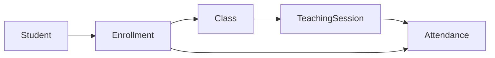
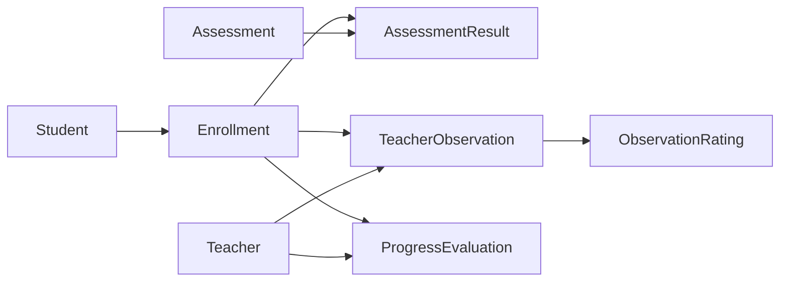
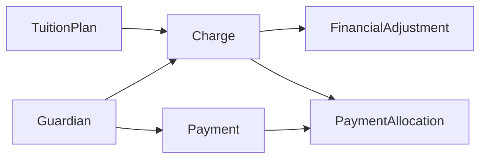
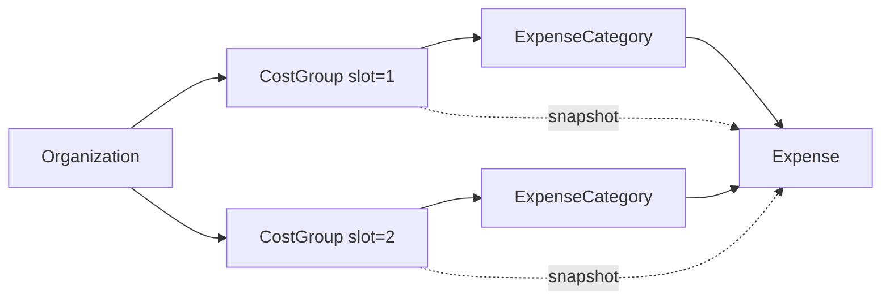
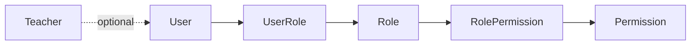

# M0-T02 — Entity-Relationship Diagram

**Date:** 2026-09-14

Logical ER model for Olli canonical domain. Physical table/column names finalized in M0-T03.

---

## Full Domain ER Diagram

```mermaid
erDiagram
    Organization ||--o{ User : has
    Organization ||--o{ Role : defines
    Organization ||--o{ Student : has
    Organization ||--o{ Guardian : has
    Organization ||--o{ Teacher : employs
    Organization ||--o{ Course : offers
    Organization ||--o{ CostGroup : configures
    Organization ||--o{ TuitionPlan : defines

    User ||--o{ UserRole : assigned
    Role ||--o{ UserRole : grants
    Role ||--o{ RolePermission : includes
    Permission ||--o{ RolePermission : granted_by

    Teacher o|--o| User : "optional login"

    Student ||--o{ StudentGuardian : linked
    Guardian ||--o{ StudentGuardian : linked

    Course ||--o{ Class : instantiates
    Class ||--o{ ClassSchedule : "planned schedule"
    Class ||--o{ ClassTeacherAssignment : assigns
    Teacher ||--o{ ClassTeacherAssignment : assigned_to
    Class ||--o{ Enrollment : receives
    Student ||--o{ Enrollment : registers

    Class ||--o{ TeachingSession : holds
    ClassSchedule o|--o{ TeachingSession : "may generate"
    Teacher ||--o{ TeachingSession : "teaches session"
    TeachingSession ||--o{ Attendance : records
    Enrollment ||--o{ Attendance : "attended via"

    Class ||--o{ Assessment : evaluates
    Assessment ||--o{ AssessmentResult : produces
    Enrollment ||--o{ AssessmentResult : "result for"

    Enrollment ||--o{ TeacherObservation : observed
    Teacher ||--o{ TeacherObservation : observes
    TeachingSession o|--o{ TeacherObservation : "optional context"
    TeacherObservation ||--o{ ObservationRating : rates

    Enrollment ||--o{ ProgressEvaluation : evaluated
    Teacher ||--o{ ProgressEvaluation : evaluates

    TuitionPlan o|--o{ Charge : "priced from"
    Enrollment ||--o{ Charge : generates
    Student ||--o{ Charge : owed_by
    Guardian ||--o{ Charge : billed_to
    Charge ||--o{ FinancialAdjustment : adjusted_by
    Guardian ||--o{ Payment : pays
    Payment ||--o{ PaymentAllocation : allocates
    Charge ||--o{ PaymentAllocation : "paid toward"

    CostGroup ||--o{ ExpenseCategory : contains
    ExpenseCategory ||--o{ Expense : classifies
    CostGroup o|--o{ Expense : "snapshot at post"
    Teacher o|--o{ Expense : "optional attribution"
    Class o|--o{ Expense : "optional attribution"
```

---

## Chain: Student → Attendance



---

## Chain: Learning Evidence



---

## Chain: Finance (No Receivable)



---

## Chain: Cost B Structure



> Group business names are **pending confirmation**. Structure uses `group_slot` 1 and 2 only.

---

## Chain: Access Control



---

## Entity Count in Diagram

| Domain | Entities |
|--------|----------|
| Organization & Access | Organization, User, Role, Permission, RolePermission, UserRole |
| People | Student, Guardian, StudentGuardian, Teacher |
| Academic Operations | Course, Class, ClassSchedule, Enrollment, ClassTeacherAssignment, TeachingSession, Attendance |
| Learning Evidence | Assessment, AssessmentResult, TeacherObservation, ObservationRating, ProgressEvaluation |
| Finance | TuitionPlan, Charge, FinancialAdjustment, Payment, PaymentAllocation, CostGroup, ExpenseCategory, Expense |
| **Total** | **30** |

---

## Explicitly Absent from ER (By Design)

| Entity | Reason |
|--------|--------|
| Receivable | Derived from Charge |
| InvoiceLine | Duplicate of Charge |
| FinancialPeriod | Deferred |
| LocalePreference | Locale on User/Organization |
| LMS entities | Out of product scope |
