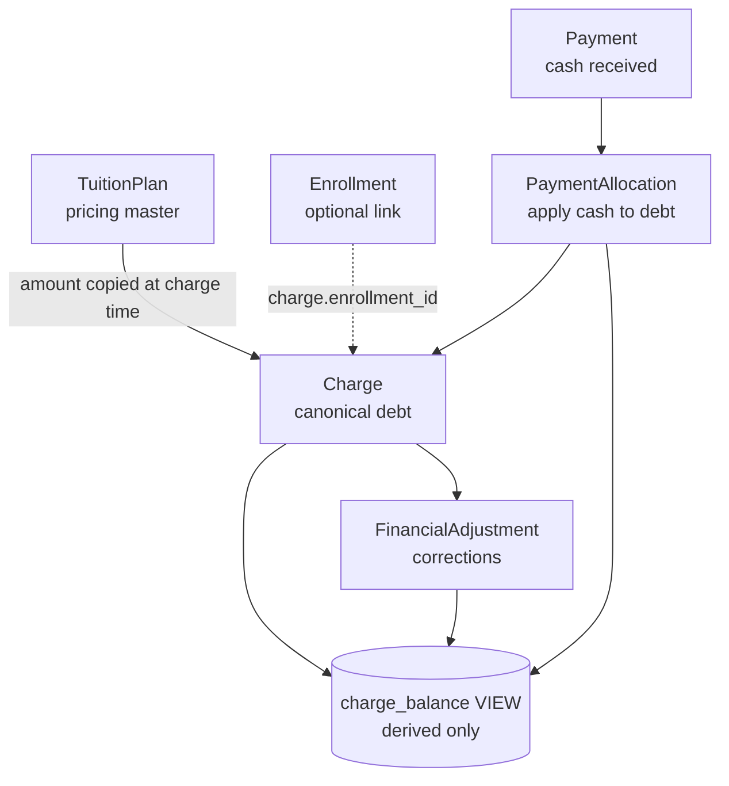
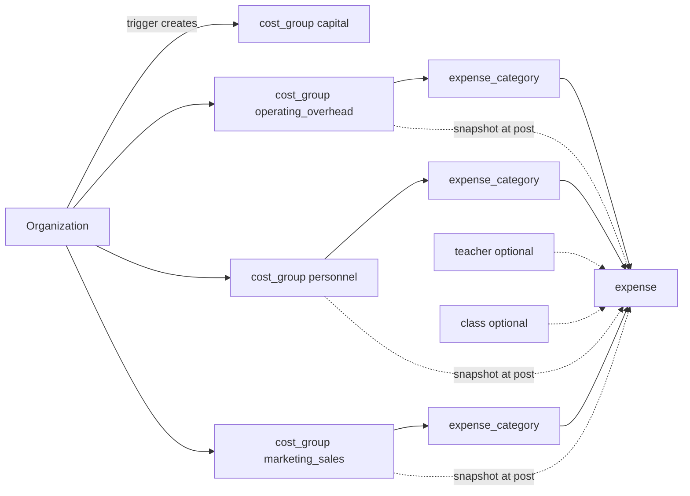
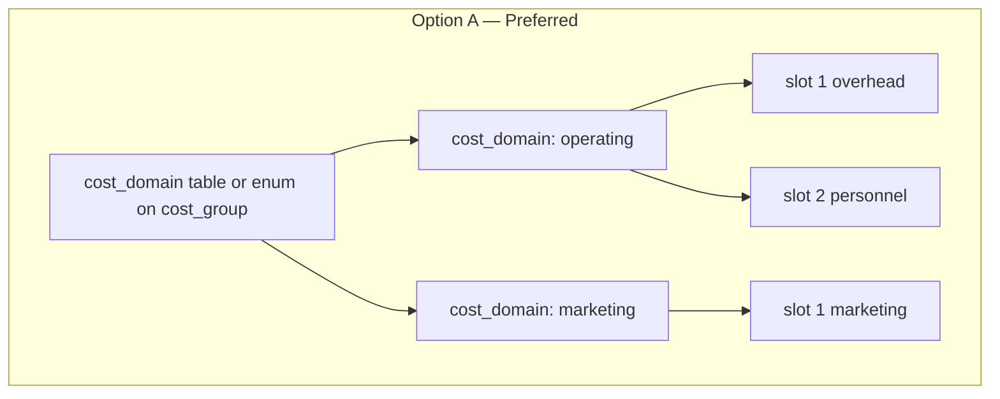
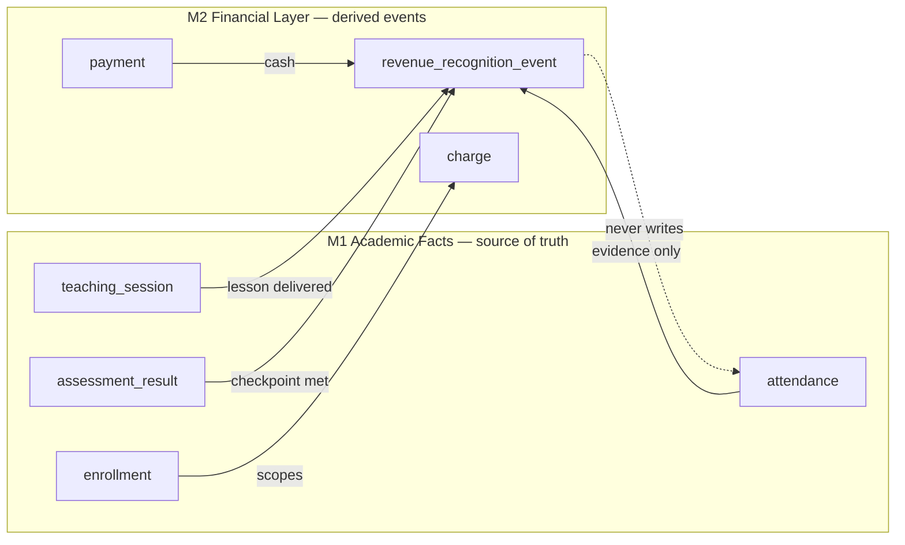
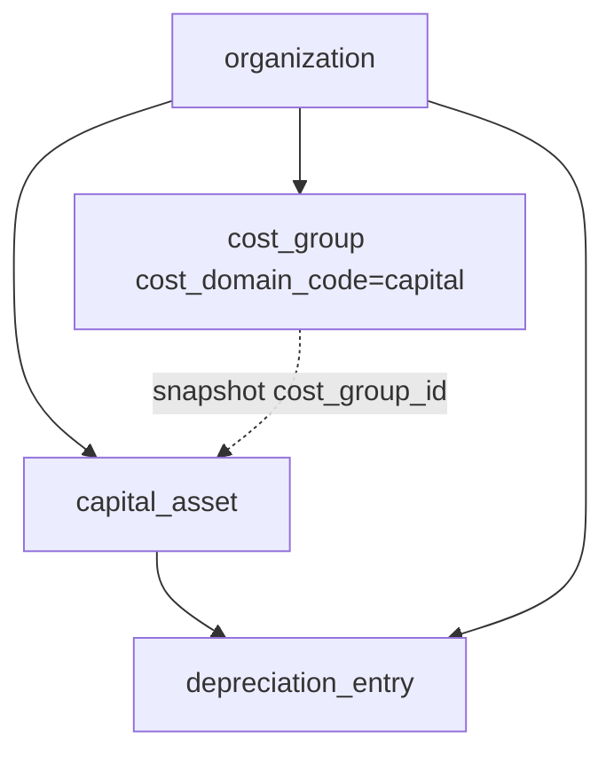

# M2-T01 — Finance Baseline Audit & Domain Contract

**Date:** 2026-09-15  
**Baseline commit:** `2526990` (branch `main`, clean working tree)  
**M1 status:** CLOSED — academic operations intentionally finance-decoupled  
**Purpose:** Canonical M2 finance contract before implementation. Audit-only; no schema or engine changes in T01.

**Related M0 references:** [09-finance-model.md](./m0/09-finance-model.md), [07-canonical-domain-model.md](./m0/07-canonical-domain-model.md), [20-rls-policy-matrix.md](./m0/20-rls-policy-matrix.md), [31-status-code-registry.md](./m0/31-status-code-registry.md)

---

## 1. Existing Finance Architecture

### 1.1 Summary

M0 established a **transaction-chain finance foundation** in PostgreSQL (Supabase). M1 built academic operations on top without wiring finance into the application layer. Finance exists as:

| Layer | Status |
|-------|--------|
| Physical schema (8 finance tables + 1 derived view) | **Present** (M0) |
| Triggers, constraints, RLS | **Present** (M0–M0-T05) |
| Permissions (`charge.*`, `payment.*`, `expense.*`) | **Present** (reference migration) |
| Integrity & security tests | **Present** (M0 suites) |
| Application UI / Server Actions | **Absent** (M1 explicitly out of scope) |
| Revenue recognition / class profit | **Absent** |
| Cost A capital assets + depreciation | **Present** (M2-T03) |

There is **no duplicate finance domain** in application code. Seed data includes minimal charge/expense fixtures for security and integrity tests only.

### 1.2 Canonical transaction chain (preserved)



**Rule satisfied:** No stored `outstanding_balance`, `total_paid`, or `remaining_balance` columns on transaction tables. The only persisted derived-adjacent field is `charge.status` (`open`, `partially_paid`, `paid`, `void`) — operational lifecycle maintained by posting logic, not a substitute for the allocation chain.

**Derived view (allowed):** `charge_balance` computes per-charge outstanding from source rows only.

### 1.3 Cost architecture (M2-T02)



Each organization owns **four `cost_group` rows** identified by immutable `cost_domain_code`:

| Code | Management domain |
|------|-------------------|
| `capital` | Cost A — capital assets + monthly depreciation (M2-T03) |
| `operating_overhead` | Cost B1 |
| `personnel` | Cost B2 |
| `marketing_sales` | Cost C |

`group_slot` (1–4) is display order only; **semantic identity is `cost_domain_code`**, not slot position. Baseline B1/B2/C categories are seeded per org via `seed_organization_cost_categories()`. Cost A uses `capital_asset` + `depreciation_entry` (not `expense_category`). Asset category codes are on `capital_asset.category_code`.

### 1.4 Tenant & currency model

- **Tenant boundary:** `organization_id` on all finance tables. No `branch` entity exists; organization is the sole tenant root.
- **Currency:** `organization.currency_code` (default `VND`); monetary amounts stored as **`bigint` minor units** on `charge`, `payment`, `payment_allocation`, `financial_adjustment`, `expense`, `tuition_plan`.
- **i18n:** Stable machine codes in DB; UI labels in `messages/vi.json` and `messages/en.json`. Finance nav stub exists (`shell.finance`); no finance status translations wired yet.

### 1.5 Application usage

| Artifact | Usage |
|----------|-------|
| `scripts/api-security-smoke.mjs` | Cross-org charge isolation (API-4) |
| `scripts/assessment-smoke.mjs` | Asserts no finance mutation during M1 regression |
| `supabase/seed.sql` | Dev fixtures: 2 charges, 1 expense |
| `src/` application | **No finance pages, actions, or queries** |

M1 acceptance explicitly verifies finance tables are untouched during academic workflows.

---

## 2. Existing Schema Inventory

Physical definitions: `supabase/migrations/20260914140000_m0_foundation.sql` (+ immutability/security follow-ups).

### 2.1 `tuition_plan`

| Attribute | Detail |
|-----------|--------|
| **Purpose** | Versioned pricing master at course and/or class scope |
| **PK** | `id` |
| **Tenant** | `organization_id` NOT NULL |
| **FKs** | `(organization_id, course_id)`, `(organization_id, class_id)` — both optional |
| **Monetary** | `amount bigint`, `currency_code text` DEFAULT `VND` |
| **Status** | `active`, `inactive`, `archived` |
| **Effective dates** | `effective_from`, `effective_to` |
| **Other** | `billing_frequency_code text` DEFAULT `monthly` (no DB CHECK) |
| **Metadata** | `created_at`, `updated_at` |
| **Constraints** | `amount > 0`; date range check |
| **RLS** | ENABLE + FORCE; `charge.read` / `charge.create` |
| **App usage** | None |

**Gap:** No enrollment-level plan; no negotiated/net tuition; no recognition basis.

---

### 2.2 `charge`

| Attribute | Detail |
|-----------|--------|
| **Purpose** | **Canonical record of money owed** (single debt source) |
| **PK** | `id` |
| **Tenant** | `organization_id` NOT NULL |
| **FKs** | `student_id`, `guardian_id` (required); `enrollment_id`, `tuition_plan_id` (nullable) |
| **Monetary** | `amount bigint`, `currency_code` |
| **Status** | `open`, `partially_paid`, `paid`, `void` |
| **Dates** | `charged_at`, `due_date` |
| **Metadata** | `created_at`, `updated_at`, `created_by` |
| **Constraints** | `amount > 0`; composite org FKs; **`protect_charge_amount` trigger** — amount immutable after post |
| **RLS** | ENABLE + FORCE; `charge.*` |
| **App usage** | Security smoke + seed only |

**Gap:** `enrollment_id` nullable — not enforced as required finance anchor. No snapshots of list/negotiated tuition components on the charge row.

---

### 2.3 `financial_adjustment`

| Attribute | Detail |
|-----------|--------|
| **Purpose** | Explainable corrections without editing `charge.amount` |
| **PK** | `id` |
| **Tenant** | `organization_id` NOT NULL |
| **FKs** | `charge_id`; `approved_by` → `app_user` |
| **Monetary** | `amount_delta bigint` (signed, ≠ 0) |
| **Type codes** | `discount`, `waiver`, `correction`, `reversal` |
| **Status** | `posted`, `void` |
| **Dates** | `adjusted_at` |
| **Metadata** | `created_at`; `reason_code`, `notes` |
| **RLS** | ENABLE + FORCE; `charge.create` for writes |
| **App usage** | Integrity tests |

---

### 2.4 `payment`

| Attribute | Detail |
|-----------|--------|
| **Purpose** | Cash received from payer (guardian) |
| **PK** | `id` |
| **Tenant** | `organization_id` NOT NULL |
| **FKs** | `guardian_id`; `created_by` → `app_user` |
| **Monetary** | `amount bigint`, `currency_code` |
| **Status** | `posted`, `void` |
| **Dates** | `paid_at timestamptz` |
| **Other** | `method_code` DEFAULT `cash` (no DB CHECK); `reference_number` |
| **Metadata** | `created_at`, `created_by` |
| **RLS** | ENABLE + FORCE; `payment.*` |
| **App usage** | Integrity tests |

**Gap:** Payment records cash only; no distinction between prepaid liability and recognized revenue.

---

### 2.5 `payment_allocation`

| Attribute | Detail |
|-----------|--------|
| **Purpose** | Apply payment (or part) to one charge |
| **PK** | `id` |
| **Tenant** | `organization_id` NOT NULL |
| **FKs** | `payment_id`, `charge_id` |
| **Monetary** | `amount bigint` (> 0) |
| **Dates** | `allocated_at` |
| **Constraints** | **`validate_payment_allocations` trigger** — Σ allocations ≤ payment.amount |
| **RLS** | ENABLE + FORCE; `payment.record` |
| **App usage** | Integrity tests |

---

### 2.6 `cost_group`

| Attribute | Detail |
|-----------|--------|
| **Purpose** | Organization-owned management cost domain anchor |
| **PK** | `id` |
| **Tenant** | `organization_id` NOT NULL |
| **Key fields** | `cost_domain_code text NOT NULL` — `capital`, `operating_overhead`, `personnel`, `marketing_sales`; `group_slot smallint` CHECK `(1–4)` (display order); `code text` nullable mirror; `status` |
| **Constraints** | `UNIQUE (organization_id, cost_domain_code)`; `UNIQUE (organization_id, group_slot)`; `protect_cost_group_domain_code` trigger (immutable domain) |
| **Metadata** | `created_at`, `updated_at` |
| **Initialization** | `initialize_organization_cost_groups` → 4 domains + `seed_organization_cost_categories()` |
| **RLS** | ENABLE + FORCE; **SELECT only** (`expense.read`) — no INSERT/UPDATE policies |
| **App usage** | Seed + integrity/M2 cost-domain tests |

**Migration backfill (M2-T02):** legacy slot 1 → `operating_overhead`, slot 2 → `personnel`; added `capital` (slot 3) and `marketing_sales` (slot 4) without replacing existing row IDs.

---

### 2.7 `expense_category`

| Attribute | Detail |
|-----------|--------|
| **Purpose** | Subclassification within one cost group |
| **PK** | `id` |
| **Tenant** | `organization_id` NOT NULL |
| **FKs** | `cost_group_id` |
| **Fields** | `code` nullable; `display_name` (user label — not canonical code); `status` |
| **Constraints** | **`prevent_expense_category_reparent`** if posted expenses exist |
| **RLS** | ENABLE + FORCE; `expense.*` |
| **App usage** | Seed + integrity tests |

---

### 2.8 `expense`

| Attribute | Detail |
|-----------|--------|
| **Purpose** | Actual cash spent (operating cost transaction) |
| **PK** | `id` |
| **Tenant** | `organization_id` NOT NULL |
| **FKs** | `expense_category_id`, `cost_group_id` (snapshot), optional `teacher_id`, optional `class_id`, `created_by` |
| **Monetary** | `amount bigint`, `currency_code` |
| **Status** | `posted`, `void` |
| **Dates** | `incurred_date` |
| **Constraints** | **`validate_expense_cost_group`** — posted `cost_group_id` must match category's group |
| **RLS** | ENABLE + FORCE; `expense.*` |
| **App usage** | Seed + integrity tests |

**Personnel link:** `teacher_id` optional — connects to `teacher.user_id` → `app_user` when staff login exists. No salary rate table; no welfare-fund-specific structure.

---

### 2.9 `charge_balance` (VIEW)

| Attribute | Detail |
|-----------|--------|
| **Purpose** | Reporting helper — outstanding per charge |
| **Columns** | `charge_id`, `organization_id`, `outstanding_balance` |
| **Formula** | `amount + Σ(adjustments) − Σ(allocations)` for non-void charges |
| **Security** | `security_invoker = true` (M0-T05); RLS on underlying tables applies |
| **Grants** | SELECT to `authenticated` only |
| **Tests** | 5 dedicated tests in `m0_charge_balance_tests.sql` |

---

### 2.10 Finance-related functions & RPCs

| Function | Type | Purpose |
|----------|------|---------|
| `validate_payment_allocations()` | Trigger | Over-allocation guard |
| `protect_charge_amount()` | Trigger | Charge amount immutability |
| `prevent_expense_category_reparent()` | Trigger | Historical category integrity |
| `validate_expense_cost_group()` | Trigger | Expense/group snapshot consistency |
| `initialize_organization_cost_groups()` | Trigger | Auto-create slots 1 & 2 |

**No finance business RPCs** (no `post_payment`, `generate_charges`, etc.). M1 RPCs (`transfer_enrollment`, `generate_teaching_sessions`) are academic-only and do not touch finance.

---

### 2.11 Finance permissions (global catalog)

From `20260914140100_reference_data.sql`:

| Code | Scope |
|------|-------|
| `charge.create` | Tuition plans, charges, adjustments |
| `charge.read` | Read charges, plans, adjustments |
| `payment.record` | Payments and allocations |
| `payment.read` | Read payments and allocations |
| `expense.create` | Categories and expenses |
| `expense.read` | Cost groups, categories, expenses |
| `report.read` | Reserved; unused in M1 |

**Unused in M1 app:** all finance permissions (assigned to admin roles in seed only).

---

## 3. Canonical Structures to Preserve

M2 **must build upon** these; do not replace or duplicate:

| Structure | Rationale |
|-----------|-----------|
| `TuitionPlan → Charge → PaymentAllocation ← Payment` | Accepted M0 debt/cash chain; Receivable/InvoiceLine explicitly rejected |
| `FinancialAdjustment` for corrections | Charge amount immutability enforced by trigger |
| `Enrollment` as student–class relationship | No finance-specific membership table |
| `charge.enrollment_id` FK | Obligations attach to enrollment, not parallel link |
| `Guardian` as payer | `payment.guardian_id`, `charge.guardian_id`, `is_billing_contact` |
| `cost_group` + `expense_category` + `expense` for Cost B | Operating cost foundation with group snapshot |
| `expense.cost_group_id` snapshot | Historical integrity when categories change |
| `expense.teacher_id` / `expense.class_id` optional attribution | Direct cost hooks for class economics |
| `charge_balance` as derived view only | Pattern for all balance-like reporting |
| `organization_id` + RLS + FORCE on all finance tables | Tenant isolation baseline |
| `bigint` minor-unit money columns | Consistent with VND operations |
| Stable status/type codes + i18n in app layer | Bilingual architecture |
| No DELETE grants on operational tables | Void/status transitions only |

---

## 4. M2 Requirements Matrix

| M2 Requirement | M0/M1 Support | Gap |
|----------------|---------------|-----|
| **Cost A — setup / depreciation** | `capital_asset`, `depreciation_entry`, RPCs (M2-T03) | Class allocation of depreciation; cash-flow bridge for acquisition |
| **Cost B1 — overhead** | `cost_group` slot 1 + expense | Labels, UI, allocation rules |
| **Cost B2 — personnel + staff link** | Slot 2 + `expense.teacher_id` + `teacher.user_id` | Salary rates, welfare fund category, multi-role costing |
| **Cost C — marketing/sales** | None (2-slot limit) | Domain separation migration required |
| **Individualized enrollment tuition** | `tuition_plan` course/class scope; nullable `charge.enrollment_id` | Enrollment terms, negotiated rates |
| **Charge / payment operations** | Schema + tests | Application layer, status sync |
| **Prepaid vs revenue** | Cash = `payment` only | Liability + recognition events |
| **Recognition method 1 — per lesson** | `teaching_session` + `attendance` (M1) | Recognition engine + policy config |
| **Recognition method 2 — checkpoints** | `assessment` + `assessment_result` (M1) | Configurable stages, not hard-coded 40/4 |
| **Class economics / profit** | Partial inputs (charge via enrollment, expense.class_id) | Allocation engine, depreciation share, marketing attribution |
| **New-class simulation** | Class lifecycle `planned/trial/active/closed` | Simulator, projected cost/revenue model |
| **Finance UI** | Nav stub only | Full CRUD/reporting surfaces |
| **Multi-tenant security** | Complete RLS | Finance RPC review when added |
| **Historical integrity** | Charge amount, expense group snapshot | Tuition/policy snapshots, recognition immutability |
| **Reporting** | `charge_balance`, `report.read` permission | P&L, class profit, cash vs accrual reports |

---

## 5. Gap Analysis

### 5.1 Cost A — Setup / long-lived investment

**Implemented in M2-T03** (see Appendix D). Summary:

| Concept | Implementation |
|---------|----------------|
| Capital asset register | `capital_asset` — org-scoped; snapshots `cost_group_id` where `cost_domain_code = 'capital'` |
| Quick mode | `create_quick_capital_asset()` → one aggregated asset (`is_quick_mode = true`) |
| Detailed mode | `create_capital_asset()` per item; later additions are independent rows |
| Monthly depreciation | `depreciation_entry` — straight-line schedule; **not** duplicated as `expense` rows |
| Cash vs management cost | Acquisition stored on asset; P/L impact via posted depreciation only |

**Deferred:** room/equipment FK, disposal gain/loss, acquisition payment linkage, class depreciation allocation.

### 5.2 Cost B — Monthly operations

**Partially supported.**

| Sub-area | Existing | Gap |
|----------|----------|-----|
| B1 Overhead | `operating_overhead` domain + baseline categories | Recurring expense templates; org-wide allocation basis |
| B2 Personnel | `personnel` domain + baseline categories; `expense.teacher_id`; `teacher.user_id` | No personnel rate engine; no `app_user` direct expense FK |
| Class attribution | `expense.class_id` optional | Allocation rules for shared overhead/personnel not defined |

### 5.3 Cost C — Marketing & sales

**Domain and baseline categories present (M2-T02).** Attribution and class-level allocation remain future work.

**Implemented in M2-T02 (supersedes pre-migration recommendation below):**



1. Introduce **`cost_domain_code`** (`operating`, `marketing`, and optionally `capital` for reporting boundaries) on `cost_group`.
2. Relax `group_slot IN (1, 2)` to **`UNIQUE (organization_id, cost_domain_code, group_slot)`** so marketing gets its own slot namespace.
3. Migrate existing org rows: slot 1/2 → `cost_domain_code = 'operating'`; insert marketing group via migration/backfill.
4. Preserve **`expense.cost_group_id` snapshot** semantics — marketing expenses never land in operating groups.
5. **Do not** rename slot 1/2 to marketing — that would corrupt Cost B semantics.

Cost A remains **outside** the expense/cost_group chain (depreciation entries may post to expense only via explicit, auditable monthly recognition bridge — future decision).

### 5.4 Tuition

| Need | Status |
|------|--------|
| Published/list tuition | `tuition_plan` at course/class level |
| Negotiated/net per enrollment | **Missing** — need `enrollment_financial_terms` or equivalent |
| Discounts/adjustments | `financial_adjustment` at charge level ✓ |
| Actual obligation | `charge.amount` + adjustments ✓ |
| Recognition basis | **Missing** |
| Collected / allocated cash | `payment` + `payment_allocation` ✓ |
| Recognized revenue | **Missing** |
| Service obligation / deferred revenue | **Missing** |
| Receivable | Derived from `charge_balance` ✓ (not separate entity — per M0 decision) |

### 5.5 Payments

Schema complete. Gaps: application posting workflow, charge status synchronization (`open` → `partially_paid` → `paid`), void/contra patterns, receipt generation.

### 5.6 Revenue recognition

**No tables, no engine, no policy config.**

Prepaid rule: cash received ≠ revenue until service delivery — requires **`deferred_revenue` / service obligation balance** derived from payments minus recognition events (not a single `balance` column).

### 5.7 Enrollment finance

- `enrollment` has no financial fields (correct — finance attaches via charges).
- **`charge.enrollment_id` should become required** for tuition charges (CHECK or app validation).
- Need enrollment-level terms capturing list price reference, negotiated amount, discount policy, recognition method reference.

### 5.8 Class economics

**Inputs inventory:**

| Input | Source | Status |
|-------|--------|--------|
| Class revenue (cash) | Σ allocations to charges where enrollment.class_id | Derivable |
| Class revenue (recognized) | Recognition events scoped to enrollment | **Missing** |
| Direct personnel | `expense.teacher_id` + class teacher assignments | Partial |
| Allocated operating cost | Org expenses without class_id | **Missing allocation rules** |
| Marketing cost | Cost C expenses + class/campaign attribution | **Missing** |
| Depreciation | Cost A monthly entries allocated by room/class | **Missing** |

### 5.9 Simulation

**Dependencies present:** `class.status` (`planned`, `trial`, `active`, `closed`), `class.capacity`, `tuition_plan`, teacher assignments, schedules/sessions (for lesson count).

**Missing:** simulation scenario entity (non-persisted or draft), break-even calculator, projected recognition vs cash, cost allocation previews.

### 5.10 Reporting

- `charge_balance` view exists.
- No class P&L, marketing ROI, depreciation schedule, or cash-vs-accrual reports.
- `report.read` permission unused — define finance report permission matrix in M2.

### 5.11 Security

- All finance tables: RLS + FORCE ✓
- Composite `(organization_id, …)` FKs on finance links ✓
- `cost_group` API read-only — writes only via trigger/migration ✓
- **Risk:** future SECURITY DEFINER finance RPCs must replicate permission checks
- **Risk:** new finance views must use `security_invoker = true` (project convention)

---

## 6. Proposed Future Migration Sequence

Order driven by **physical dependencies** and **accounting integrity** (configure → transact → recognize → allocate → analyze):

| Phase | Task focus | Depends on |
|-------|------------|------------|
| ~~**M2-T02**~~ | **DONE** — `cost_domain_code` on `cost_group`, four domains, baseline categories, snapshot preserved | M0 cost_group |
| ~~**M2-T03**~~ | **DONE** — Cost A: `capital_asset`, `depreciation_entry`, quick/detailed convergence, immutability | T02 |
| ~~**M2-T04**~~ | **DONE** — Enrollment financial terms, payment schedule, charge generation with provenance | M1 enrollment |
| **M2-T05** | Payment & adjustment application layer (Server Actions, charge status sync, no new debt entities) | T04 |
| **M2-T06** | Revenue recognition: policy config, recognition events, prepaid/deferred derivation | T05, M1 sessions/attendance/assessments |
| **M2-T07** | Personnel cost templates & welfare fund category (Cost B2 completion) | T02 |
| **M2-T08** | Class cost allocation rules + contribution report (read models) | T02–T07 |
| **M2-T09** | New-class financial simulator (read-only projection) | T04, T08 |
| **M2-T10** | Finance UI + bilingual labels + permission refinement | T05+ |
| **M2-T11** | M2 acceptance & finance regression suite | All |

**Rationale:** Establish cost taxonomy before allocation; establish enrollment tuition before recognition; recognition consumes M1 academic facts; simulator last.

---

## 7. Academic → Finance Boundary

### 7.1 Principle

**M1 is the academic source of truth.** M2 consumes facts; it does not duplicate enrollment, attendance, or assessment data.



### 7.2 Canonical M1 entities for recognition

| Academic fact | Table / field | Finance use |
|---------------|---------------|-------------|
| Student in class | `enrollment` | Scope charges, recognition, class revenue |
| Enrollment lifecycle | `enrollment.status`, dates | Stop recognition; final adjustments |
| Lesson scheduled/delivered | `teaching_session.status = completed` | Method 1 — per-lesson recognition trigger |
| Attendance recorded | `attendance.status` | Evidence of delivery; **not** a payment |
| Course progression | Session count vs plan | Remaining service obligation |
| Checkpoint / test | `assessment` + `assessment_result.finalized` | Method 2 — stage recognition (stages configured in finance policy, not hard-coded) |
| Class lifecycle | `class.status` | Simulation states; stop new charges when `closed` |
| Teacher assignment | `class_teacher_assignment` | Personnel cost attribution input |

### 7.3 Explicit separations

| Academic fact | NOT |
|---------------|-----|
| `attendance.status = present` | Payment or revenue transaction |
| `assessment_result.raw_score` | Billing amount |
| `enrollment.status = completed` | Automatic final payment |
| `teaching_session.completed` | Automatic charge creation (unless explicit billing job) |

Financial recognition events are **append-only finance records** referencing academic entity IDs — they do not mutate M1 rows.

---

## 8. Cost A / B / C Contract

### 8.1 Cost A — Setup / long-lived investment

| Mode | User input | System behavior |
|------|------------|-----------------|
| Quick | Total investment, depreciation period (months) | Generate asset + straight-line monthly schedule |
| Detailed | Per-item: name, acquisition_date, amount, useful_life, notes/category | Each item independent; additions append |
| Recognition | — | Monthly depreciation entry; historical months immutable |

**Invariant:** Editing useful life or total on a posted asset does not rewrite past `depreciation_entry` rows — use adjustment entries.

### 8.2 Cost B — Monthly operations (two groups only)

| Group | Slot | Examples | Schema hook |
|-------|------|----------|-------------|
| **B1 Overhead** | 1 | Rent, utilities, internet, service fees | `cost_group` slot 1 + `expense_category` |
| **B2 Personnel** | 2 | Salaries, welfare fund baseline, employer costs | Slot 2 + `expense.teacher_id` → `teacher` → `app_user` |

**Personnel rules:**

- Staff may hold multiple roles via `user_role` — costing may use role-effective dates.
- Welfare fund: Cost B baseline category; monthly cash true-up handled in cash reporting layer later.
- Counselor/sales salaries belong in **Cost C**, not B2, when attributable to marketing.

### 8.3 Cost C — Marketing & sales

Separate domain for management visibility as profit driver:

- Advertising, campaigns, marketing expenses
- Counselor/sales salaries, commissions

**Must not** be folded into B1/B2 merely because legacy schema has two slots. Requires migration in §5.3.

---

## 9. Tuition & Revenue-Recognition Contract

### 9.1 Per-enrollment financial dimensions (do not collapse)

| Dimension | Storage direction |
|-----------|-------------------|
| Published/list tuition | Reference to applicable `tuition_plan` + snapshot amount on terms/charge |
| Negotiated/net tuition | `enrollment_financial_terms.negotiated_amount` (future) |
| Discounts/adjustments | `financial_adjustment` on resulting charges |
| Actual obligation | `charge.amount` + Σ adjustments |
| Recognition basis | Policy FK on enrollment terms (`per_lesson`, `stage_checkpoint`, …) |
| Collected cash | Σ `payment_allocation` to enrollment's charges |
| Allocated cash | Same as collected (allocation chain) |
| Recognized revenue | Σ `revenue_recognition_event.amount` (future) |
| Remaining service obligation | Derived: obligation − recognized |
| Receivable | Derived: obligation − allocated cash (via `charge_balance` chain) |

### 9.2 Prepaid tuition rule

> Cash received in advance is **not** automatically revenue.

| Concept | Derivation |
|---------|------------|
| Cash collected | Σ `payment.amount` (allocated) |
| Recognized revenue | Σ recognition events |
| Deferred revenue / service obligation | Collected − recognized (per enrollment) |

### 9.3 Recognition methods (configurable)

**Method 1 — Per lesson**

- Trigger eligibility: `teaching_session.status = completed` (+ optional attendance policy)
- Recognize fixed portion per session according to enrollment terms / plan split

**Method 2 — Stage / checkpoint**

- Policy defines N stages (not hard-coded 40 lessons / 4 tests)
- Checkpoint sources: `assessment_result.finalized` mapped to stage config, or manual admin checkpoint
- Portion locked at each stage per center policy

**Policy table (future):** stage definitions, percentages or amounts, course/class applicability, effective dates.

---

## 10. Class Economics Contract

### 10.1 Target formula (future engine)

```
Class Contribution =
    Class Revenue (recognized)
  − Direct personnel cost (attributed expenses + teacher cost)
  − Allocated operating cost (B1 share)
  − Applicable marketing/sales cost (C share)
  − Applicable depreciation (A share)
```

### 10.2 Input readiness

| Input | Ready | Notes |
|-------|-------|-------|
| Enrollments in class | ✓ | `enrollment.class_id` |
| Charges by class | Partial | Via `charge.enrollment_id` join |
| Payments allocated | ✓ | Join through charge |
| Direct expense by class | ✓ | `expense.class_id` |
| Teacher on class | ✓ | `class_teacher_assignment` |
| Sessions delivered | ✓ | `teaching_session` |
| Overhead pool | Partial | Expenses without class_id exist; no allocator |
| Marketing pool | ✗ | Cost C missing |
| Depreciation | Partial | Cost A schedule exists; class allocation rules missing |
| Recognized vs cash revenue | ✗ | Recognition missing |

All outputs are **read models** — no stored `class_profit` column.

---

## 11. Simulation Dependencies

### 11.1 Class lifecycle (available)

`class.status`: `planned` → `trial` → `active` → `closed` (M1-T05)

### 11.2 Variable inputs (future simulator)

| Input | Source |
|-------|--------|
| Planned learners | User input / `class.capacity` default |
| Tuition per enrollment | `tuition_plan` or override |
| Teacher/personnel cost | Personnel templates (future) |
| Room/operating allocation | Overhead allocation rules (future) |
| Marketing/sales cost | Cost C templates (future) |
| Course length / lesson count | Schedule + session generation or manual |

### 11.3 Projected outputs (derived, not stored)

Revenue, total cost, contribution, margin %, break-even student count.

### 11.4 Gaps

No simulation entity, no draft/proforma persistence contract, no API — define in M2-T09.

---

## 12. Security & RLS Findings

| Object | org boundary | RLS | FORCE | Notes |
|--------|--------------|-----|-------|-------|
| `tuition_plan` | ✓ | ✓ | ✓ | charge permissions |
| `charge` | ✓ | ✓ | ✓ | amount immutability |
| `financial_adjustment` | ✓ | ✓ | ✓ | |
| `payment` | ✓ | ✓ | ✓ | |
| `payment_allocation` | ✓ | ✓ | ✓ | cross-org blocked by composite FK |
| `cost_group` | ✓ | ✓ | ✓ | read-only via API |
| `expense_category` | ✓ | ✓ | ✓ | |
| `expense` | ✓ | ✓ | ✓ | group/category triggers |
| `charge_balance` | ✓ | invoker | — | inherits underlying RLS |

**Verified tests:** 30 M0 integrity + 30 security + 5 charge_balance + API smoke cross-org charge isolation.

**Future requirements:**

- New finance views: `security_invoker = true`, documented in security inventory
- Finance RPCs: SECURITY INVOKER preferred; explicit `has_permission` gates if DEFINER
- No weakening of M0/M1 deny-by-default posture

---

## 13. Historical-Integrity Rules

| Entity | Immutable when posted | Correction path | Snapshot fields |
|--------|----------------------|-----------------|-----------------|
| `charge.amount` | ✓ (trigger) | `financial_adjustment` | Copy from plan at creation (app rule) |
| `payment.amount` | App convention | Void + contra payment | — |
| `financial_adjustment` | Append-only | Void + reversal row | — |
| `expense.amount` | App convention | Void | `cost_group_id` at post |
| `tuition_plan.amount` | Soft rule (not trigger) | New plan row / effective window | Referenced by `charge.tuition_plan_id` |
| `expense_category` | Reparent blocked if posted expenses | Archive + new category | Expense keeps category FK |
| Future: recognition events | Must be append-only | Reversal event | Policy ID + basis snapshot |
| `depreciation_entry` (posted) | ✓ (trigger) | Void + explicit correction (future); no silent UPDATE | Asset `cost_group_id` snapshot |
| `capital_asset` core fields | After posted depreciation (trigger) | Retire asset; no cost/life rewrite | `cost_group_id` at creation |

**Configuration edits** (category rename, plan price change) must not alter historical transaction meaning.

---

## 14. i18n Implications

New M2 labels required (stable codes in DB; translations in `messages/`):

| Category | Example codes | Namespace pattern |
|----------|---------------|-------------------|
| Cost domains | `operating`, `marketing`, `capital` | `costDomain.*` |
| Cost B groups | `overhead`, `personnel` | `costGroup.*` |
| Depreciation | `scheduled`, `posted`, `void` | `status.depreciationEntry.*` |
| Recognition | `per_lesson`, `stage_checkpoint` | `recognitionMethod.*` |
| Finance UI | charges, payments, expenses, reports | `finance.*` |
| Adjustment reasons | extend `adjustmentType.*` | existing pattern |
| Payment methods | `cash`, `transfer`, … | `paymentMethod.*` |

**Do not** store Vietnamese/English labels in `expense_category.display_name` as the canonical identifier — prefer `code` for machine use; display_name is presentation (existing pattern).

---

## 15. Explicit Non-Goals for M2-T01

This task did **not**:

- Implement depreciation, revenue recognition, or class profitability engines
- Build the new-class simulator
- Add migrations or alter M1 academic schema
- Create finance UI or Server Actions
- Introduce duplicate debt entities (Receivable, InvoiceLine, stored balances)
- Seed Cost B/C business labels in migrations (pending product confirmation)
- Weaken RLS or permissions

---

## Appendix A — Enrollment Boundary Audit

```text
Student ↔ Enrollment ↔ Class     ✓ Canonical (M1)
Charge.enrollment_id             ✓ Present but NULLABLE — should be required for tuition charges in M2
Separate finance membership      ✗ None (correct)
Enrollment financial fields      ✗ None on enrollment table (correct — separate terms entity recommended)
```

**Missing link:** Enrollment-level negotiated tuition and required enrollment FK on tuition charges.

---

## Appendix B — Transaction Chain Compliance

| Rule | Compliant |
|------|-----------|
| TuitionPlan → Charge → PaymentAllocation ← Payment | ✓ |
| Corrections via FinancialAdjustment | ✓ |
| No stored outstanding_balance on tables | ✓ |
| Derived balance in view only | ✓ (`charge_balance`) |
| No Receivable duplicate entity | ✓ |

---

---

## Appendix C — M2-T02 Cost Domain Implementation (commit after `e0c99e5`)

**Migration:** `20260914141500_m2_t02_cost_domain_extension.sql`

**Historical integrity:** `expense.cost_group_id` continues to snapshot the `cost_group.id` at post time. Domain backfill assigns semantic codes to existing groups without changing row IDs. Reparent and group/category mismatch triggers unchanged.

**Cost A handoff to M2-T03:** `capital` domain exists as an empty `cost_group` per org. Capital assets and depreciation entries will attach to this domain — not to ordinary `expense` rows.

**i18n:** `costDomain.*` and `expenseCategory.*` keys in `messages/en.json` and `messages/vi.json`.

---

---

## Appendix D — M2-T03 Capital Assets & Depreciation (after `316dc53`)

**Migration:** `20260914141600_m2_t03_capital_assets_depreciation.sql`

### Physical model



**Tables:**

| Table | Purpose |
|-------|---------|
| `capital_asset` | Long-lived investment register (quick or detailed) |
| `depreciation_entry` | Monthly straight-line allocation into management cost |

**Not used for Cost A:** `expense`, `expense_category` — operating expenditure remains separate.

### Quick vs detailed mode

Both modes persist **`capital_asset`** rows and share **`generate_depreciation_schedule`** (trigger on INSERT).

| Mode | Entry point | Semantics |
|------|-------------|-----------|
| Quick | `create_quick_capital_asset(total, months, placed_in_service_date, name?)` | Aggregated “initial setup investment”; `is_quick_mode = true`; default category `other_capital` |
| Detailed | `create_capital_asset(name, cost, date, months, category?, notes?)` | One real-world asset per row |

No parallel `quick_capital_cost` table.

### Depreciation method

- Persisted code: `depreciation_method_code = 'straight_line'` (CHECK-constrained).
- Amount function: `straight_line_depreciation_amount(cost, N, period_number)`.

### Start period rule

First depreciation period = **calendar month of `placed_in_service_date`** (normalized to month-start via `capital_asset_period_month`).

Period *k* month = `date_trunc('month', placed_in_service_date) + (k - 1) months`.

**Not** derived from `created_at`.

### Remainder handling (integer integrity)

For cost `C` and life `N` months:

- Periods `1 .. N-1`: `floor(C / N)` minor units each.
- Period `N`: `C - floor(C/N) × (N-1)` — absorbs remainder.

**Invariant:** `SUM(all depreciation_entry.amount) = original_cost` exactly.

### Schedule generation architecture (Option A)

Full schedule of `scheduled` rows created on asset INSERT via `trg_capital_asset_generate_schedule`.

- If only `scheduled` rows exist, asset cost/life/date edits delete and regenerate scheduled rows.
- If any `posted` row exists, regeneration is blocked; core asset fields are immutable (trigger).

**Posting:** `post_depreciation_through(asset_id, through_month)` transitions `scheduled` → `posted` for periods ≤ through_month.

### Recognition states

| Status | Meaning |
|--------|---------|
| `scheduled` | Future/unposted plan row; may be regenerated or voided on retirement |
| `posted` | Historical management cost; immutable (trigger) |
| `void` | Explicitly cancelled period (retirement voids future scheduled) |

### Historical integrity

1. Posted depreciation rows cannot be UPDATEd (amount, period, status).
2. After posted depreciation, `capital_asset` original_cost, useful_life_months, placed_in_service_date, cost_group_id cannot change.
3. Corrections are explicit (future: adjustment entries) — no silent rewrite.
4. `UNIQUE (capital_asset_id, period_number)` and `UNIQUE (capital_asset_id, period_month)` prevent duplicate periods.

### Retirement

`retire_capital_asset(asset_id, retired_at)` sets `status = 'retired'`, records `retired_at`, voids **scheduled** entries with `period_month > month(retired_at)`.

No disposal gain/loss accounting in M2-T03.

### Cash vs management cost

| Event | Representation |
|-------|----------------|
| Capital purchase (cash outflow) | `capital_asset.original_cost` + `placed_in_service_date` — **not** an `expense` row |
| Monthly management P/L | `depreciation_entry` where `status = 'posted'` |

Future cash-flow reporting may link acquisition to payments; M2-T03 does not force AP or expense duplication.

### Cost A reporting resolution

```text
capital_asset.cost_group_id → cost_group.cost_domain_code = 'capital'
```

Monthly Cost A management cost for period P:

```sql
SELECT SUM(amount) FROM depreciation_entry
WHERE organization_id = :org
  AND status = 'posted'
  AND period_month = :P;
```

Join to `capital_asset` for per-asset breakdown. **No dependency on `group_slot`.**

Accumulated depreciation and book value are **derived**:

- `SUM(posted depreciation_entry.amount)`
- `original_cost - accumulated`

### Security

| Object | RLS | Permissions |
|--------|-----|-------------|
| `capital_asset` | ENABLE + FORCE | `asset.read`, `asset.create`, `asset.update` |
| `depreciation_entry` | ENABLE + FORCE | `asset.read`; writes via RPC/triggers |

RPCs (`create_capital_asset`, `create_quick_capital_asset`, `post_depreciation_through`, `retire_capital_asset`) are **SECURITY INVOKER** with `has_permission` checks.

### Application layer (no UI)

- `src/lib/capital-assets/` — validation, constants
- `src/app/actions/capital-assets.ts` — server actions calling RPCs

### i18n

`capitalAsset.*`, `assetCategory.*`, `assetStatus.*`, `depreciation.*` in EN/VI.

### Tests

`supabase/tests/m2_capital_depreciation_tests.sql` — 20 scenarios.

### Handoff to class economics (deferred)

Class P&L will consume posted depreciation via allocation rules (M2-T08). Per-class shares of Cost A are not computed in T03.

### Intentional simplifications

- Straight-line only
- No acquisition payment / AP linkage
- No depreciation → `expense` auto-bridge
- No stored accumulated_depreciation or book_value columns
- No cron; posting is explicit RPC

---

---

## Appendix E — M2-T04 Enrollment Financial Terms & Charge Generation (after `f1fbe52`)

**Migration:** `20260914141700_m2_t04_enrollment_financial_terms.sql`

### Canonical pricing rule

```text
Course / Class → academic structure only
Enrollment → enrollment_financial_terms → net tuition (authoritative)
Payment schedule → enrollment_payment_schedule_item
Obligations → charge (charge_source_code = tuition)
```

Tuition is **not** authoritative on `course`, `class`, or `tuition_plan.amount` alone.

### Role of `tuition_plan`

`tuition_plan` remains a **optional list-price / payment-plan template** at course or class scope. It may be referenced by `enrollment_financial_terms.tuition_plan_id` but does **not** determine per-student net tuition. Existing rows are preserved; no destructive migration.

### Physical model

| Table | Purpose |
|-------|---------|
| `enrollment_financial_terms` | Per-enrollment commercial agreement |
| `enrollment_payment_schedule_item` | Deterministic due schedule (no paid amounts) |

**Charge extensions:** `enrollment_financial_terms_id`, `enrollment_payment_schedule_item_id` (UNIQUE), `charge_source_code`, `agreed_tuition_snapshot`, `net_tuition_snapshot`.

**Tuition charge invariant:** `charge_source_code = 'tuition'` ⇒ `enrollment_id`, terms, and schedule item required.

### Net tuition formula

```text
net_tuition_amount = agreed_tuition_amount - discount_amount
```

Enforced by CHECK; `bigint` minor units; `net_tuition_amount >= 0`.

### Lifecycle

| Status | Meaning |
|--------|---------|
| `draft` | Editable; schedule mutable |
| `active` | Core monetary fields immutable; charges may be generated |
| `superseded` | Historical agreement replaced |
| `cancelled` | Voided agreement |

One `draft` and one `active` row per enrollment (partial unique indexes).

### Payment schedule modes

All modes converge on `enrollment_payment_schedule_item`:

| Mode | RPC |
|------|-----|
| Full upfront | `set_enrollment_payment_schedule_full_upfront` |
| Deposit + remainder | `set_enrollment_payment_schedule_deposit_remainder` |
| Equal installments | `set_enrollment_payment_schedule_installments` (integer remainder handling) |
| Custom | `set_enrollment_payment_schedule_custom(jsonb)` |

**Invariant:** `SUM(scheduled items) = net_tuition_amount` exactly.

### Charge generation

1. `activate_enrollment_financial_terms` — validates schedule, sets `active`
2. `generate_enrollment_charges` — idempotent INSERT into `charge` from schedule items

**Idempotency:** `UNIQUE (enrollment_payment_schedule_item_id)` on `charge`.

**Billing guardian:** resolved via `student_guardian.is_billing_contact`, fallback to `is_primary_contact`.

**Snapshots on charge:** `amount` from schedule item; `agreed_tuition_snapshot` / `net_tuition_snapshot` from terms at generation time.

### Historical corrections

After charges exist:

- `charge.amount` remains immutable (`protect_charge_amount`)
- Tuition reductions/increases use `apply_enrollment_tuition_correction` → `financial_adjustment` on open charges
- Active terms monetary fields cannot be silently UPDATEd (trigger)

### Separation of concerns

| Concept | Representation |
|---------|----------------|
| Net tuition | `enrollment_financial_terms.net_tuition_amount` |
| Payment timing | `enrollment_payment_schedule_item.due_date` |
| Obligation | `charge` |
| Cash received | `payment` + `payment_allocation` |
| Revenue recognition | **Deferred to M2-T06** (`recognition_basis_code` placeholder only) |

### Security

Reuses `charge.read` / `charge.create`. RLS ENABLE + FORCE on new tables. RPCs SECURITY INVOKER with permission checks.

### Application layer (no UI)

- `src/lib/enrollment-finance/`
- `src/app/actions/enrollment-finance.ts`

### Tests

`supabase/tests/m2_enrollment_financial_tests.sql` — 35 scenarios.

### Deferred

- Payment recording workflow UI
- Revenue recognition engine
- Refund/withdrawal policy
- Payer snapshot on charge (optional future)
- Enrollment cancellation financial automation

---

*Document produced by M2-T01 audit at commit `2526990`. Updated for M2-T02 at `e0c99e5`. Updated for M2-T03 and M2-T04.*
