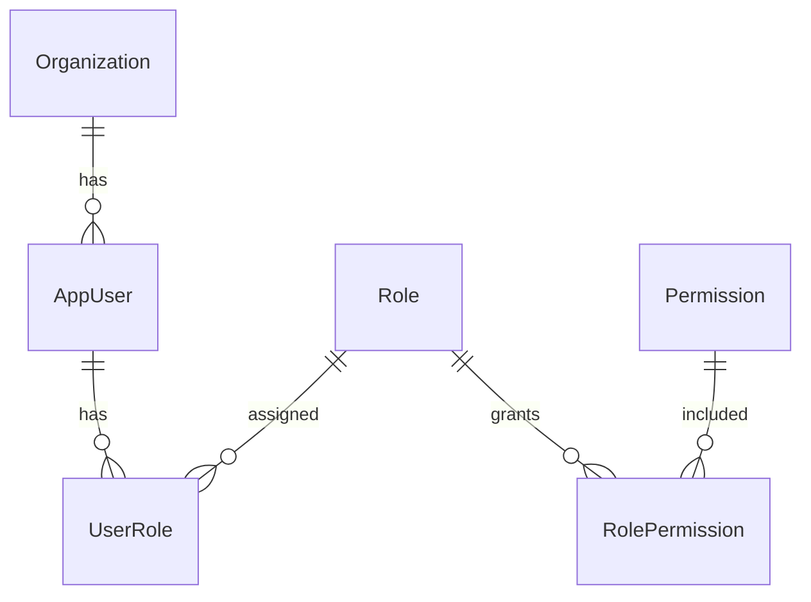
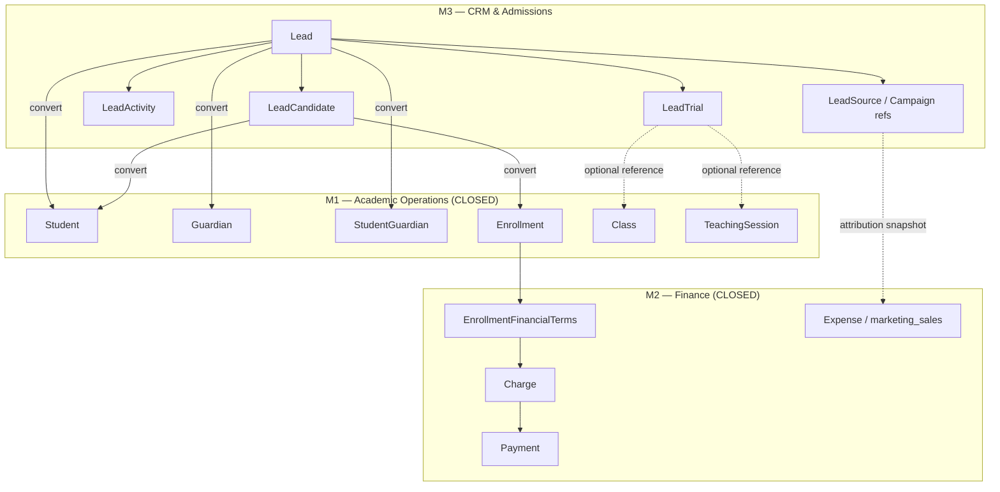
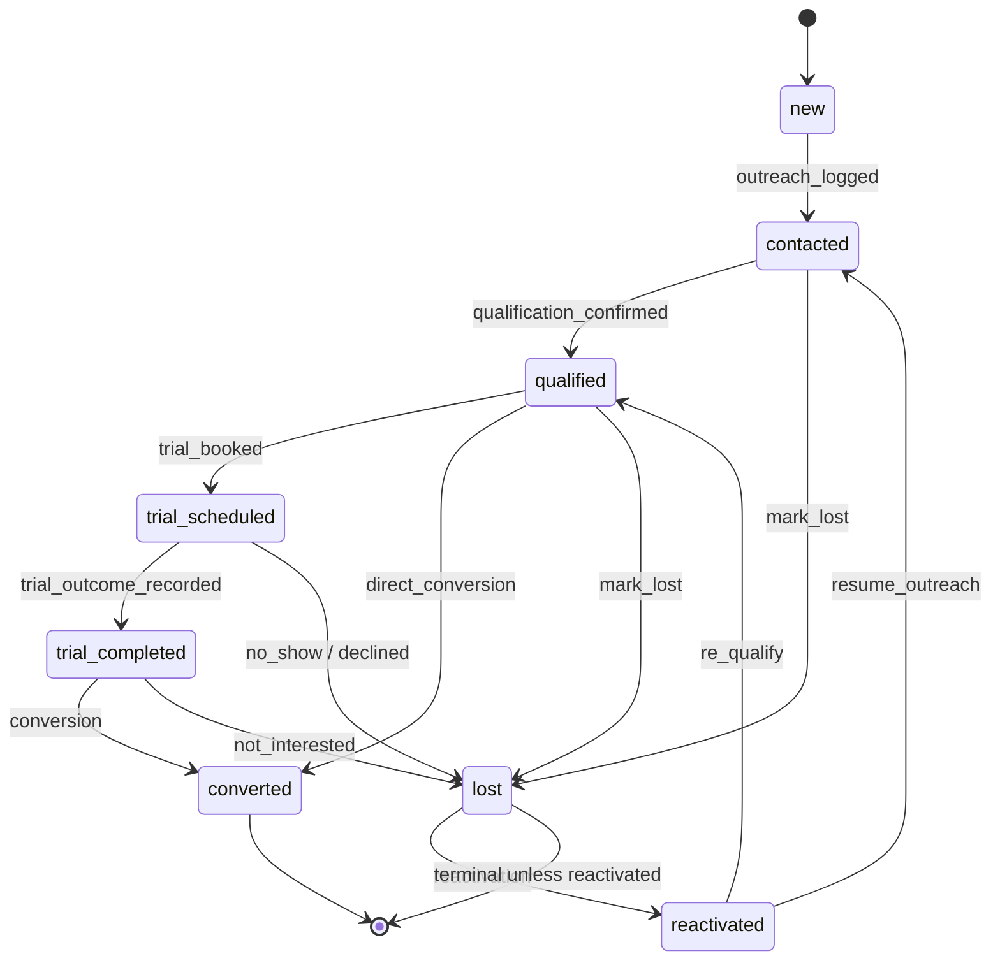
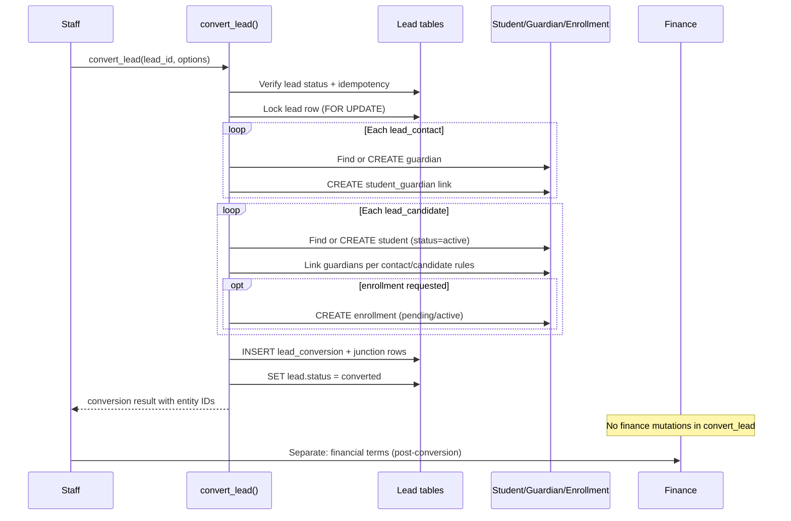

# M3-T01 — CRM & Admissions Domain Audit and Contract

**Date:** 2026-09-16  
**Baseline commit:** `2d04d88` (branch `main`, clean working tree)  
**M0 status:** CLOSED — Product & Data Foundation  
**M1 status:** CLOSED — Academic Operations  
**M2 status:** CLOSED — Finance, Revenue Recognition, Cost Allocation & Class Economics  
**Purpose:** Canonical pre-enrollment domain contract before M3 schema implementation. Audit-only in T01; no production CRM schema or behavior changes.

**Related references:** [M0 canonical domain model](./m0/07-canonical-domain-model.md), [M0 permission model](./m0/19-permission-model.md), [M0 RLS policy matrix](./m0/20-rls-policy-matrix.md), [M0 status registry](./m0/31-status-code-registry.md), [M1 Student & Guardian contract](./m1/01-student-guardian-product-contract.md), [M1 enrollment implementation](./m1/12-m1-t06-implementation.md), [M2 finance domain contract](./m2-finance-domain-contract.md)

---

## 1. Executive Summary

Olli currently manages students, guardians, enrollments, teaching, and finance **after** a learner becomes an operational student. M1 explicitly deferred "Admissions CRM / lead pipeline" and treats `student.status = 'prospect'` as a **master-data lifecycle flag**, not a sales pipeline stage. M2 finance assumes an operational enrollment with a billing guardian before charge generation.

M3 establishes a **CRM & Admissions bounded context** that owns the pre-enrollment lifecycle:

```text
Lead / inquiry → consultation & follow-up → trial → conversion → Student / Guardian / Enrollment
```

**Core architectural decisions (validated against repository evidence):**

| Decision | Rationale |
|----------|-----------|
| **Lead is not Student** | Separate `lead` domain entities; no pollution of M1 Student master data with unqualified prospects |
| **Enrollment remains M1-owned** | M3 initiates conversion; canonical `enrollment` rows use existing M1 contracts and constraints |
| **Finance remains M2-owned** | Conversion does not create charges or recognize revenue; finance begins after enrollment + financial terms |
| **Trial is CRM-scoped** | `lead_trial` references academic structures without requiring a permanent enrollment |
| **Function-based permissions** | New `lead.*` permissions; no mandatory `salesperson` role |
| **Org-scoped RLS** | Same FORCE RLS + `has_permission()` pattern as M0–M2 |

**Repository state at T01:** 23 migrations, 46 permissions, zero CRM tables/RPCs/UI. `student.status = 'prospect'` exists but is intentionally decoupled from pipeline semantics. Guardian duplicate detection is application-level warn-only. Enrollment creation is a direct INSERT via Server Action (no RPC). Only `transfer_enrollment()` exists as an enrollment RPC.

**M3-T02 readiness:** Safe to begin schema design **after** this contract is accepted. No M1/M2 incompatibilities identified that require redesign of closed domains.

**Implementation status (M3-T10 closeout, 2026-09-17):** M3 CLOSED at commit following `d0e026f`. See [`docs/m3-closeout.md`](./m3-closeout.md) for final architecture, test counts (565 DB / 549 Node smoke / 89 E2E), and production checklist. Eight M3 migrations (T02–T09) shipped; T10 added acceptance tests and closeout documentation only (no new migration).

---

## 2. Current Repository Inventory

### 2.1 Migrations (23 total — unchanged in T01)

| Migration | Domain | Key artifacts |
|-----------|--------|---------------|
| `20260914140000_m0_foundation.sql` | M0 | Core schema: org, user, role, permission, student, guardian, student_guardian, course, class, enrollment, teaching_session, attendance, charge, payment, … |
| `20260914140100_reference_data.sql` | M0 | 34 base permissions, role seeds |
| `20260914140200_auth_identity.sql` | M0 | Auth ↔ app_user mapping |
| `20260914140300_rls_helpers_and_grants.sql` | M0 | `current_organization_id()`, `has_permission()`, … |
| `20260914140400_rls_policies.sql` | M0 | FORCE RLS deny-by-default policies |
| `20260914140500_charge_amount_immutability.sql` | M0/M2 | `protect_charge_amount` trigger |
| `20260914140600_m0_t05_security_hardening.sql` | M0 | Security triggers |
| `20260914140700_m0_t06_locale_persistence.sql` | M0 | User locale |
| `20260914140800_m1_t03_student_code_unique.sql` | M1 | Partial unique on normalized `student_code` |
| `20260914140900_m1_t04_guardian_relationship.sql` | M1 | Primary contact partial unique; audit columns on `student_guardian` |
| `20260914141000_m1_t05_class_lifecycle.sql` | M1 | Class status: `planned`, `trial`, `active`, `closed` |
| `20260914141100_m1_t06_enrollment_audit_transfer.sql` | M1 | Audit FKs on enrollment; `transfer_enrollment()` RPC |
| `20260914141200_m1_t07_teaching_operations.sql` | M1 | Rooms, schedules, `generate_teaching_sessions()` |
| `20260914141300_m1_t08_attendance_observations.sql` | M1 | Attendance eligibility triggers |
| `20260914141400_m1_t09_assessments.sql` | M1 | Assessments, results, observations |
| `20260914141500_m2_t02_cost_domain_extension.sql` | M2 | `cost_domain_code` incl. `marketing_sales` |
| `20260914141600_m2_t03_capital_assets_depreciation.sql` | M2 | Capital assets, depreciation |
| `20260914141700_m2_t04_enrollment_financial_terms.sql` | M2 | Financial terms, billing guardian resolution |
| `20260914141800_m2_t05_payment_recording_allocation.sql` | M2 | Payment RPCs, reversal |
| `20260914141900_m2_t06_revenue_recognition.sql` | M2 | Revenue recognition events |
| `20260914142000_m2_t07_personnel_costing.sql` | M2 | Personnel cost entries |
| `20260914142100_m2_t08_class_cost_allocation.sql` | M2 | Class cost allocation rules |
| `20260914142200_m2_t09_class_financial_simulator.sql` | M2 | Class financial simulator |

**No M3 migrations exist.**

### 2.2 Application layer (CRM-relevant)

| Area | Path | CRM relevance |
|------|------|---------------|
| Student CRUD | `src/app/actions/students.ts` | Creates operational students; accepts `prospect` status |
| Guardian CRUD | `src/app/actions/guardians.ts` | Guardian create/link; duplicate warn-only |
| Enrollment CRUD | `src/app/actions/enrollments.ts` | Direct INSERT; no student status side effects |
| Duplicate check | `src/lib/guardians/check-guardian-duplicates.ts` | App-level phone/email match |
| Class enrollment rules | `src/lib/enrollments/class-enrollment-rules.ts` | `trial` class allows `pending`/`active` enrollment |
| Permissions helper | `src/lib/permissions/can.ts` | Typed permission codes (no CRM codes yet) |
| i18n | `messages/en.json`, `messages/vi.json` | `status.student.prospect` exists; no CRM namespace |

### 2.3 Tests and verification

| Suite | Count (M2 closeout baseline) | CRM coverage |
|-------|------------------------------|--------------|
| DB tests (`supabase/tests/`) | 303 scenarios | None |
| API/smoke scripts | 483 cases | None |
| Playwright e2e | 69 tests | None |
| i18n parity | 951/951 EN/VI | No CRM keys |
| `npm run verify` | Full chain | No `test:crm` |

### 2.4 Documentation

| Document | CRM mention |
|----------|-------------|
| `docs/m1/01-student-guardian-product-contract.md` | Explicit non-goal: admissions CRM |
| `docs/m1/03-student-field-contract.md` | `prospect` ≠ pipeline stage |
| `docs/m2-finance-domain-contract.md` | `marketing_sales` cost domain; enrollment finance handoff |
| `docs/m0/07-canonical-domain-model.md` | Logical model; no Lead entity |

**No M3 documentation existed prior to this contract.**

---

## 3. Existing Reusable Entities and Contracts

### 3.1 Organization & access (M0)



- **Tenant root:** `organization_id` on all tenant-owned records
- **Authorization:** `has_permission('code')` — never role-name checks
- **RLS:** ENABLE + FORCE; deny-by-default; no DELETE policies on people/academic tables
- **Audit columns:** `created_at`, `updated_at`, `created_by`, `updated_by` on mutable entities

### 3.2 People master data (M1)

| Entity | Reuse in M3 | Notes |
|--------|-------------|-------|
| `student` | **Target of conversion** | `status` includes `prospect` but M3 must not use Student as pre-enrollment store |
| `guardian` | **Target of conversion** | Shared across siblings; billing contact for M2 |
| `student_guardian` | **Target of conversion** | Relationship metadata, primary/billing flags |

**Student creation contract** (`src/app/actions/students.ts`):
- Required: `given_name`, `family_name`
- Optional: `student_code`, `date_of_birth`, `status` (default `active`)
- Permission: `student.create`
- Duplicate: name+DOB warning (non-blocking); `student_code` unique constraint blocks

**Guardian creation contract** (`src/app/actions/guardians.ts`):
- Required: `given_name`, `family_name`
- Optional: phone, email
- Duplicate: warn-only via `check-guardian-duplicates.ts`; `confirmDuplicate=true` to proceed
- Link: `student_guardian` with `relationship_type`, primary/billing flags
- Permission: `guardian.create` / `guardian.update`

### 3.3 Academic structure (M1)

| Entity | Reuse in M3 | Notes |
|--------|-------------|-------|
| `course` | Reference for conversion target | Staff selects course/class at conversion |
| `class` | Reference for enrollment + trial | Status `trial` supports trial-class concept |
| `enrollment` | **Conversion output** | Overlap exclusion; capacity rules |
| `teaching_session` | Optional trial reference | Attendance requires enrollment — **trials must not use attendance path without enrollment** |
| `attendance` | **Not for CRM trials** | FK to `enrollment_id`; rejects pending enrollments |

**Enrollment creation contract** (`src/app/actions/enrollments.ts`):
- Permission: `enrollment.create`
- Status: `pending` or `active` only on create
- Class rules (`class-enrollment-rules.ts`):
  - `closed` → reject
  - `planned` → `pending` only
  - `trial` / `active` → `pending` or `active`
- Overlap: DB gist exclusion on `(org, student, class, daterange)` for `pending`/`active`
- Capacity: operational count ≤ `class.capacity` (null = unlimited)
- **Does not mutate student.status**

**Transfer RPC:** `transfer_enrollment(source_id, dest_class_id, start_date, dest_status)` — atomic; SECURITY INVOKER.

### 3.4 Finance (M2)

| Entity / RPC | Reuse in M3 | Notes |
|--------------|-------------|-------|
| `enrollment_financial_terms` | Post-conversion | One active + one draft per enrollment |
| `charge` / `payment` / `payment_allocation` | Post-conversion | Requires `guardian_id`; linked via enrollment |
| `resolve_enrollment_billing_guardian_id()` | Post-conversion | Prefers billing contact, falls back to primary |
| `cost_group` (`marketing_sales`) | Attribution bridge | Cost C accounting — not lead storage |
| `expense` / `expense_category` | Optional attribution link | Campaign spend lives here, not in CRM |

**Finance entry point after CRM conversion:**

```text
convert_lead → Student + Guardian + Enrollment
             → (staff action) create_enrollment_financial_terms
             → activate_enrollment_financial_terms
             → generate_enrollment_charges
             → record_payment / allocate_payment
             → recognize_enrollment_revenue (per M2 rules)
```

CRM conversion **must not** skip to charge generation or revenue recognition.

### 3.5 Existing permissions (46 codes)

M0 base (34) + M2 additions (12). Full list in [M0 permission model](./m0/19-permission-model.md) and M2 contract Appendix. **Zero CRM permissions.**

---

## 4. Identified Gaps

| # | Gap | Impact | M3 action |
|---|-----|--------|-----------|
| G1 | No Lead/Prospect entity | Cannot track pre-enrollment pipeline | New `lead` + `lead_candidate` tables |
| G2 | `student.status=prospect` overloaded semantically | Staff may create Student too early | CRM owns pipeline; conversion creates/promotes Student |
| G3 | No CRM activity/history | No consultation/follow-up audit trail | New `lead_activity`, `lead_assignment` |
| G4 | No trial without enrollment | Cannot record trial without fake enrollment | New `lead_trial` referencing Class/Session |
| G5 | No conversion RPC | Risk of partial conversion (student without guardian) | Atomic `convert_lead()` RPC |
| G6 | No lead deduplication | Duplicate inquiries across phone/email | CRM-level dedup + link to existing Student/Guardian |
| G7 | No source/campaign attribution | Cannot trace lead → enrollment → finance | New attribution reference tables + conversion snapshot |
| G8 | No CRM permissions | Cannot authorize admissions staff | New `lead.*` permission codes |
| G9 | Guardian dedup is warn-only | CRM may create duplicate guardians on conversion | Conversion must search-and-link existing Guardian |
| G10 | No notes field on Student/Guardian | Consultation notes have no home | CRM activities carry notes; optional future M1 field |
| G11 | No owner/assignment scoping | All org users see all records | `assigned_user_id` on lead + assignment history |
| G12 | No reactivation workflow | Lost leads have no structured path back | `lost` → `reactivated` transition with reason preservation |

---

## 5. Proposed CRM Bounded Context

### 5.1 Context boundary



### 5.2 Responsibilities

| In scope (M3) | Out of scope |
|---------------|--------------|
| Lead capture and pipeline | LMS / content delivery |
| Consultation & follow-up activity log | Generic task management product |
| Trial scheduling and outcome | Fake enrollments for trials |
| Conversion orchestration to M1 entities | Replacing M1 enrollment engine |
| Source/campaign/referral attribution | Commission formula engine |
| Assignment to authorized users | Mandatory salesperson role |
| Lost reason and reactivation | Payroll, GL, tax invoicing |
| Operational links to M2 Cost C | Redesigning marketing_sales accounting |

### 5.3 Ubiquitous language

| Term | Meaning |
|------|---------|
| **Lead** | Pre-enrollment inquiry record; primary CRM aggregate |
| **Lead candidate** | Prospective learner attached to a lead (child or adult self) |
| **Conversion** | Atomic promotion from CRM to M1 master data + optional enrollment |
| **Trial** | Scheduled evaluation activity — CRM-owned, not an enrollment |
| **Contact** | Guardian or adult inquirer on the lead — not yet a canonical Guardian until conversion |

---

## 6. Proposed Canonical Entity Model

### 6.1 Entity summary

| Entity | Type | Purpose |
|--------|------|---------|
| `lead` | MD | Primary pre-enrollment inquiry; contact info, pipeline status, assignment |
| `lead_candidate` | MD | Individual prospective student (name, DOB, target course/class interest) |
| `lead_contact` | REL | Contact persons on a lead (maps to future Guardian); supports multiple contacts |
| `lead_source` | CFG | Org-scoped source catalog (walk-in, referral, Facebook, …) |
| `lead_campaign` | CFG | Optional campaign grouping for attribution |
| `lead_activity` | EV | Append-only activity log (call, message, consultation, note, …) |
| `lead_follow_up` | EV | Scheduled next action (lightweight — not full task manager) |
| `lead_assignment` | REL | Assignment history (`assigned_user_id` changes) |
| `lead_trial` | EV | Trial event linking lead/candidate to Class and/or TeachingSession |
| `lead_conversion` | EV | Immutable conversion record with FK links to created M1 entities |
| `lead_lost_reason` | CFG | Org-scoped lost reason catalog |

### 6.2 `lead` — identity vs mutable fields

**Identity fields** (used for deduplication; change requires explicit merge workflow):

| Field | Notes |
|-------|-------|
| `organization_id` | Server-derived |
| Primary phone (on lead or primary contact) | Normalized for dedup |
| Primary email (on lead or primary contact) | Normalized for dedup |

**Mutable CRM fields:**

| Field | Notes |
|-------|-------|
| `status` | Pipeline lifecycle — see §8 |
| `assigned_user_id` | Nullable; current owner |
| `lead_source_id` | Attribution |
| `lead_campaign_id` | Optional campaign |
| `referral_guardian_id` | Optional FK to existing `guardian` (referral program) |
| `referral_student_id` | Optional FK to existing `student` |
| `notes_summary` | Short free-text summary (detail in activities) |
| `lost_reason_id` / `lost_notes` | Set when status → `lost` |
| `converted_at` | Set on conversion |
| Audit columns | Standard M0 pattern |

**Dedup strategy:**
1. On lead create: search existing **open** leads by normalized phone/email within org
2. On conversion: search existing **Student** (name+DOB) and **Guardian** (phone/email) — link rather than duplicate
3. Warn + staff confirm for fuzzy matches; block on exact `student_code` conflict
4. No automatic merge of lead records in V1 — manual merge workflow deferred to M3-T05+

### 6.3 `lead_candidate`

Represents one prospective learner. A single lead may have multiple candidates (siblings).

| Field | Notes |
|-------|-------|
| `lead_id` | Parent lead |
| `given_name`, `family_name` | Required |
| `date_of_birth` | Optional |
| `target_course_id` | Optional interest |
| `target_class_id` | Optional interest |
| `converted_student_id` | Set on conversion; nullable until then |
| `status` | `active`, `converted`, `removed` |

**Adult self-enrollment:** Lead with one candidate where candidate represents the inquirer; `lead_contact` may reference same person or be omitted if contact fields live on `lead`.

### 6.4 `lead_contact`

Supports multiple contacts per lead (mother + father, corporate contact, etc.).

| Field | Notes |
|-------|-------|
| `lead_id` | |
| `given_name`, `family_name` | Required |
| `phone`, `email` | Optional |
| `relationship_type_code` | Reuse M1 codes: `mother`, `father`, `guardian`, `other` |
| `is_primary_contact` | One per lead |
| `is_billing_contact` | Carried into conversion → `student_guardian.is_billing_contact` |
| `converted_guardian_id` | Set on conversion |

### 6.5 Conversion output links (`lead_conversion`)

Immutable event row created once per successful conversion:

| Field | Notes |
|-------|-------|
| `lead_id` | Source lead |
| `converted_by` | app_user |
| `converted_at` | timestamptz |
| `student_ids` | uuid[] or junction table `lead_conversion_student` |
| `guardian_ids` | uuid[] or junction |
| `enrollment_ids` | uuid[] or junction — optional if conversion is student-only |
| `idempotency_key` | Optional; prevents double conversion |

---

## 7. Entity Relationship Diagram

```mermaid
erDiagram
    Organization ||--o{ Lead : owns
    Organization ||--o{ LeadSource : configures
    Organization ||--o{ LeadCampaign : configures
    Organization ||--o{ LeadLostReason : configures

    Lead ||--o{ LeadCandidate : has
    Lead ||--o{ LeadContact : has
    Lead ||--o{ LeadActivity : logs
    Lead ||--o{ LeadFollowUp : schedules
    Lead ||--o{ LeadAssignment : tracks
    Lead ||--o{ LeadTrial : schedules
    Lead ||--o| LeadConversion : produces

    Lead }o--|| LeadSource : attributed
    Lead }o--o| LeadCampaign : attributed
    Lead }o--o| AppUser : assigned_to

    LeadCandidate }o--o| Course : interested_in
    LeadCandidate }o--o| Class : interested_in
    LeadCandidate }o--o| Student : converted_to

    LeadContact }o--o| Guardian : converted_to

    LeadTrial }o--o| Class : at
    LeadTrial }o--o| TeachingSession : at
    LeadTrial }o--|| LeadCandidate : for

    LeadConversion ||--o{ LeadConversionStudent : links
    LeadConversion ||--o{ LeadConversionGuardian : links
    LeadConversion ||--o{ LeadConversionEnrollment : links

    LeadConversionStudent }o--|| Student : creates_or_links
    LeadConversionGuardian }o--|| Guardian : creates_or_links
    LeadConversionEnrollment }o--|| Enrollment : creates

    Student ||--o{ StudentGuardian : has
    Guardian ||--o{ StudentGuardian : has
    Student ||--o{ Enrollment : has
    Enrollment }o--|| Class : in

    Lead }o--o| Guardian : referral_from
    Lead }o--o| Student : referral_from
    LeadCampaign }o--o| Expense : optional_spend_link
```

---

## 8. Prospect Lifecycle / State Machine

### 8.1 Lead status codes (proposed)

| Code | Meaning | Entry trigger |
|------|---------|---------------|
| `new` | Captured; no outreach yet | Lead create |
| `contacted` | Staff reached contact | First contact activity |
| `qualified` | Fit confirmed; pursuing enrollment | Staff qualification |
| `trial_scheduled` | Trial booked | Trial record created |
| `trial_completed` | Trial occurred; outcome recorded | Trial outcome logged |
| `converted` | Promoted to M1 entities | Successful conversion |
| `lost` | Closed without conversion | Staff marks lost |
| `reactivated` | Previously lost; re-opened | Reactivation action |

**Note:** These are **lead.status** values — distinct from `student.status = 'prospect'`.

### 8.2 State machine



### 8.3 Transition rules

| Rule | Detail |
|------|--------|
| Forward-only by default | Staff may skip stages (e.g. `new` → `converted`) with permission |
| `converted` is terminal | No edit of pipeline status after conversion; M1 entities govern thereafter |
| `lost` preserves history | All activities, trials, assignments remain readable |
| Status changes logged | Append `lead_activity` with `activity_type = 'status_change'` |
| Auto-transitions | Optional: first activity auto-moves `new` → `contacted` (configurable per org later) |
| Student.status | On conversion: set candidate's Student to `active` (explicit; not automatic on enrollment alone) |

### 8.4 Historical preservation

- Never hard-delete lead rows
- `lead_activity` is append-only (no UPDATE/DELETE policies)
- `lead_assignment` records each ownership change with `effective_from`/`effective_to`
- `lead_conversion` is immutable once written

---

## 9. Lead → Student / Guardian / Enrollment Conversion Contract

### 9.1 Conversion prerequisites

| Check | Source |
|-------|--------|
| Lead status ∉ (`converted`, `lost`) or reactivated | CRM |
| Actor has `lead.convert` permission | Auth |
| At least one `lead_candidate` with names | CRM |
| Primary contact present (on lead or `lead_contact`) | CRM |
| Target class open for enrollment (if enrolling) | M1 `class-enrollment-rules.ts` |
| Capacity available | M1 enrollment action |
| Billing contact designated (if enrolling + future finance) | CRM → M1 `student_guardian` |

### 9.2 Conversion steps (atomic RPC: `convert_lead`)



### 9.3 Idempotency and double-conversion protection

| Mechanism | Detail |
|-----------|--------|
| Status guard | Reject if `lead.status = 'converted'` |
| `lead_conversion` unique on `lead_id` | One conversion event per lead |
| Optional `idempotency_key` | Client-supplied; unique per org |
| Partial failure | Entire RPC rolls back — no orphan Student without Guardian |

### 9.4 Match-or-create rules

| Entity | Match keys | On match | On no match |
|--------|------------|----------|-------------|
| Guardian | Normalized phone, then email | Link existing | INSERT new |
| Student | Normalized phone N/A; name+DOB fuzzy; exact student_code | Link existing (staff confirm) | INSERT new, status=`active` |
| StudentGuardian | (student_id, guardian_id) | Reactivate if ended | INSERT new |
| Enrollment | Overlap check | Return conflict error | INSERT via M1 rules |

### 9.5 Post-conversion visibility

- Lead record remains readable with `status = converted`
- All activities, trials, assignments preserved
- UI shows links to created Student/Guardian/Enrollment records
- CRM tab on student detail (future UI) shows originating lead — via `lead_conversion` junction

### 9.6 Relationship to `student.status = prospect`

| Scenario | Behavior |
|----------|----------|
| Legacy prospect students (pre-M3) | Remain valid; no retroactive lead creation required |
| New inquiries (post-M3) | Create **Lead**, not Student |
| Conversion | Creates Student with `status = active` (recommended default) |
| Staff override | May set `prospect` on Student only via explicit conversion option for edge cases |

**M3 must not require all prospects to become Leads retroactively.**

---

## 10. Trial Boundary

### 10.1 Problem statement

M1 `attendance` requires `enrollment_id`. Creating a fake permanent enrollment corrupts academic records and may trigger finance paths. `class.status = 'trial'` exists for trial-oriented classes but enrollment is still required for attendance.

### 10.2 Options analyzed

| Option | Pros | Cons | Verdict |
|--------|------|------|---------|
| A. Trial = real Enrollment (`pending`) | Reuses attendance | Pollutes enrollment history; may affect capacity/economics | **Reject** |
| B. Trial = CRM-only (`lead_trial`) | Clean boundary; no academic corruption | No attendance tracking for trial | **Recommended V1** |
| C. Trial = TeachingSession reference only | Links to schedule | Session alone lacks outcome context | Partial — combine with B |
| D. Trial = separate `trial_enrollment` entity | Academic isolation | New M1 entity violates closed boundary | **Reject** |
| E. Trial = `pending` enrollment + `is_trial` flag on enrollment | Explicit marking | Requires M1 schema change | **Defer** — only if B proves insufficient |

### 10.3 Recommended model: `lead_trial`

| Field | Notes |
|-------|-------|
| `lead_id`, `lead_candidate_id` | Required links |
| `class_id` | Required — must reference class with status `trial` or `active` |
| `teaching_session_id` | Optional — set when session known |
| `scheduled_at` | timestamptz |
| `outcome_code` | `scheduled`, `completed`, `no_show`, `cancelled`, `converted` |
| `outcome_notes` | Free text |
| `staff_user_id` | Who ran the trial |

**Rules:**
- No `enrollment` row created for trial
- No `attendance` row for trial
- Trial outcome may trigger lead status → `trial_completed`
- If prospect enrolls after positive trial, **conversion creates a fresh enrollment** — trial history remains on lead

### 10.4 Future extension (not M3-T02)

If centers require trial attendance tracking, propose M3-T08+ **`trial` enrollment type** as a separate M1 amendment — only with documented incompatibility. Not in initial M3 scope.

---

## 11. Activity / Follow-up Model

### 11.1 `lead_activity` (append-only)

| Field | Notes |
|-------|-------|
| `lead_id` | Required |
| `activity_type_code` | See below |
| `occurred_at` | When it happened |
| `notes` | Free text |
| `created_by` | app_user |
| `metadata` | jsonb — channel, duration, outcome codes |

**Activity type codes (proposed):**

| Code | Use |
|------|-----|
| `call` | Phone call |
| `message` | SMS, Zalo, email, social |
| `consultation` | In-person or video consultation |
| `note` | Internal note |
| `follow_up` | Follow-up completed (pairs with follow_up entity) |
| `appointment` | Scheduled meeting |
| `trial` | Trial-related (may also link `lead_trial`) |
| `status_change` | Pipeline transition audit |
| `assignment_change` | Ownership change audit |

### 11.2 `lead_follow_up` (lightweight scheduling)

| Field | Notes |
|-------|-------|
| `lead_id` | Required |
| `due_at` | timestamptz |
| `follow_up_type_code` | `call`, `message`, `appointment`, `other` |
| `notes` | Brief |
| `status` | `pending`, `completed`, `cancelled`, `snoozed` |
| `completed_at` | Set when done |
| `completed_by` | app_user |

**Scope limit (anti task-manager):**
- Follow-ups belong to a lead only — no generic org-wide task board in M3 V1
- Completing a follow-up creates a `lead_activity` with `activity_type = follow_up`
- Overdue follow-ups surface on lead list/dashboard — not a separate project management module

---

## 12. Ownership / Assignment Model

### 12.1 Current state

RLS is org-wide within permission — no row-level owner scoping exists in M0–M2.

### 12.2 Proposed model

| Field | Location | Purpose |
|-------|----------|---------|
| `assigned_user_id` | `lead` | Current responsible staff member |
| `lead_assignment` | History table | Each assignment change |

**`lead_assignment` columns:**

| Field | Notes |
|-------|-------|
| `lead_id` | |
| `assigned_user_id` | FK → app_user |
| `assigned_by` | Who made the assignment |
| `effective_from` | timestamptz |
| `effective_to` | Nullable — null = current |
| `notes` | Optional reason |

### 12.3 Rules

| Rule | Detail |
|------|--------|
| No mandatory sales role | Any user with `lead.assign` may assign |
| Self-assignment | Allowed with `lead.update` |
| Unassigned leads | `assigned_user_id` nullable — visible to all with `lead.read` |
| Owner-scoped views | UI filter only in V1 — RLS remains org+permission based |
| Future | Optional `lead.read_assigned` permission for owner-scoped RLS (M3-T06+ if needed) |

---

## 13. Source / Campaign / Referral Attribution Model

### 13.1 Design principle

CRM stores **attribution references**; M2 stores **financial facts**. No duplication of expense amounts on lead rows.

### 13.2 Reference entities

**`lead_source`** (org-scoped catalog):

| Field | Notes |
|-------|-------|
| `code` | Stable machine code: `walk_in`, `facebook`, `referral`, `website`, … |
| `display_name` | User label (supplemented by i18n) |
| `status` | `active`, `inactive` |

**`lead_campaign`** (optional grouping):

| Field | Notes |
|-------|-------|
| `code`, `name` | |
| `start_date`, `end_date` | Optional window |
| `expense_id` | Optional FK → M2 `expense` (marketing spend) |
| `status` | `active`, `inactive`, `archived` |

### 13.3 Attribution chain

```text
Lead.lead_source_id / lead_campaign_id
    → (conversion snapshot copied to lead_conversion)
    → Enrollment (via lead_conversion_enrollment)
    → Payment / Charge (existing M2 — no CRM FK required on charge)
    → Class economics (existing M2 allocation)
```

**Conversion snapshot:** `lead_conversion` stores `lead_source_id`, `lead_campaign_id`, `referral_guardian_id` at conversion time — immutable attribution even if catalog entries later change.

### 13.4 M2 Cost C bridge (read-only)

| M2 entity | CRM relationship |
|-----------|------------------|
| `cost_group` (`marketing_sales`) | No schema change |
| `expense` / `expense_category` | `lead_campaign.expense_id` optional link |
| Personnel costing (`counselor_sales_salary`) | Independent — no CRM FK |

**Commission formula engine: OUT OF SCOPE.**

---

## 14. CRM ↔ M1 Boundary

### 14.1 What M3 may do

| Action | Mechanism |
|--------|-----------|
| Create Student | INSERT via conversion RPC (same validation as M1) |
| Create Guardian | INSERT via conversion RPC |
| Create StudentGuardian | INSERT via conversion RPC |
| Create Enrollment | INSERT via conversion RPC (M1 overlap/capacity rules) |
| Read Course/Class | SELECT with `enrollment.read` or `lead.read` |
| Reference TeachingSession | SELECT for trial scheduling |

### 14.2 What M3 must not do

| Prohibited | Reason |
|------------|--------|
| Modify M1 enrollment RPCs | Closed domain |
| Change attendance eligibility rules | Closed domain |
| Add columns to `student`, `guardian`, `enrollment` without justified migration | Minimize M1 churn |
| Auto-change student.status on enrollment | M1 contract: staff decides |
| Create shadow Student/Guardian tables | Duplication |

### 14.3 Safest handoff contract

**Recommended:** Single SECURITY INVOKER RPC `convert_lead()` that internally:

1. Validates permissions (`lead.convert` + implicit need for `student.create`, `guardian.create`, `enrollment.create` — either require all or grant via RPC SECURITY DEFINER with permission checks)
2. Performs M1-equivalent validation (reuse shared validation functions where possible)
3. Writes M1 rows in one transaction
4. Writes CRM conversion record
5. Returns created/linked entity IDs

**Alternative considered:** Orchestrate existing Server Actions sequentially — **rejected** due to partial-failure risk and no cross-action transaction.

### 14.4 M1 entities M3 reads but does not own

| Entity | Use |
|--------|-----|
| `course`, `class` | Conversion target selection; trial class reference |
| `teaching_session` | Trial scheduling reference |
| `student`, `guardian` | Dedup search at conversion |
| `app_user` | Assignment target |

---

## 15. CRM ↔ M2 Boundary

### 15.1 Finance lifecycle entry point

CRM conversion **ends** at Enrollment creation. Finance begins when staff explicitly creates financial terms:

```text
convert_lead
  → Enrollment exists
  → (separate staff action) create_enrollment_financial_terms
  → activate_enrollment_financial_terms
  → generate_enrollment_charges
  → record_payment → allocate_payment
  → recognize_enrollment_revenue
```

### 15.2 Explicit separations

| Concept | Owner | CRM must not |
|---------|-------|--------------|
| Tuition agreement | M2 `enrollment_financial_terms` | Store agreed amounts on lead |
| Debt | M2 `charge` | Create charges at conversion |
| Cash | M2 `payment` | Record deposits as conversion side-effect |
| Revenue | M2 `revenue_recognition_event` | Recognize revenue at conversion |
| Marketing spend | M2 `expense` (Cost C) | Duplicate expense on lead |
| Class economics | M2 allocation engine | Include trial leads in economics |

### 15.3 Deposit / trial fee (deferred)

Some centers collect trial fees or deposits pre-enrollment. **Not in M3 V1.** If needed later:

- Option A: Record as M2 payment with nullable enrollment (requires M2 amendment)
- Option B: CRM `lead_payment_intent` staging table (M3-T10+)

Neither is implemented in T02 without separate approval.

### 15.4 Billing guardian handoff

Conversion must set `student_guardian.is_billing_contact` from `lead_contact.is_billing_contact` so M2 `resolve_enrollment_billing_guardian_id()` works unchanged.

---

## 16. Permissions / RLS / Security Model

### 16.1 Proposed permission codes

| Code | Capability |
|------|------------|
| `lead.read` | View leads, candidates, activities, trials |
| `lead.create` | Create leads and candidates |
| `lead.update` | Edit lead fields, log activities, manage follow-ups |
| `lead.assign` | Change `assigned_user_id` |
| `lead.convert` | Execute conversion to M1 entities |
| `lead.manage_sources` | CRUD on lead_source, lead_campaign, lost_reason catalogs |

**Total new permissions:** 6 (bringing registry to 52)

### 16.2 Permission interactions

| Action | Permissions required |
|--------|---------------------|
| View pipeline | `lead.read` |
| Create inquiry | `lead.create` |
| Log call/note | `lead.update` |
| Assign to colleague | `lead.assign` |
| Convert to student | `lead.convert` + RPC checks `student.create`, `guardian.create`, `enrollment.create` |
| Configure sources | `lead.manage_sources` |

No `salesperson` role required. Small centers may grant all `lead.*` to `admin` or a custom "Admissions" role.

### 16.3 RLS policy pattern (proposed)

Follow M0 conventions from `20260914140400_rls_policies.sql`:

| Table | SELECT | INSERT | UPDATE | DELETE |
|-------|--------|--------|--------|--------|
| `lead` | `lead.read` + org | `lead.create` + org | `lead.update` + org | **Deny** |
| `lead_candidate` | `lead.read` + org | `lead.create` + org | `lead.update` + org | **Deny** |
| `lead_contact` | `lead.read` + org | `lead.create` + org | `lead.update` + org | **Deny** |
| `lead_activity` | `lead.read` + org | `lead.update` + org | **Deny** | **Deny** |
| `lead_follow_up` | `lead.read` + org | `lead.update` + org | `lead.update` + org | **Deny** |
| `lead_trial` | `lead.read` + org | `lead.update` + org | `lead.update` + org | **Deny** |
| `lead_assignment` | `lead.read` + org | `lead.assign` + org | **Deny** | **Deny** |
| `lead_conversion` | `lead.read` + org | RPC only | **Deny** | **Deny** |
| `lead_source`, `lead_campaign`, `lead_lost_reason` | `lead.read` + org | `lead.manage_sources` + org | `lead.manage_sources` + org | **Deny** |

All policies: `ENABLE ROW LEVEL SECURITY` + `FORCE ROW LEVEL SECURITY`.

### 16.4 SECURITY DEFINER RPCs

| RPC | Model |
|-----|-------|
| `convert_lead()` | SECURITY INVOKER with explicit permission checks — consistent with `transfer_enrollment()` |

Prefer INVOKER unless cross-table permission elevation is required.

### 16.5 Tenant isolation

- All CRM tables include `organization_id NOT NULL`
- Composite FK pattern: `UNIQUE (organization_id, id)` on parent tables
- Client never supplies authoritative `organization_id` — server derives from `current_organization_id()`

---

## 17. Audit / History Requirements

| Requirement | Implementation |
|-------------|----------------|
| Who created/modified lead | `created_by`, `updated_by` on mutable entities |
| Activity history | Append-only `lead_activity` |
| Assignment history | `lead_assignment` with effective dates |
| Status transitions | `lead_activity` with `activity_type = status_change` + old/new in metadata |
| Conversion immutability | `lead_conversion` — no UPDATE policy |
| Trial outcomes | `lead_trial` + linked activity |
| Lost reason | `lost_reason_id`, `lost_notes`, `lost_at`, `lost_by` on lead |
| Reactivation | Activity + status change; preserve prior lost reason |
| Field-level audit | **Not in M3 V1** — defer to M3-T07+ if required |
| Alignment with M1 | Same audit column conventions; no new `enrollment_audit` table |

---

## 18. Bilingual / i18n Implications

### 18.1 Architecture (unchanged)

- Machine codes in DB (`lead.status`, `activity_type_code`, `lead_source.code`)
- UI labels in `messages/en.json` and `messages/vi.json`
- Parity enforced by `npm run test:i18n`

### 18.2 Proposed i18n namespaces

| Namespace | Contents |
|-----------|----------|
| `crm.title` | Module name |
| `crm.leads.*` | Lead list, detail, form labels |
| `crm.pipeline.*` | Status labels |
| `status.lead.*` | Lead status translations |
| `activity.lead.*` | Activity type translations |
| `crm.sources.*` | Source catalog labels (defaults; org may override display_name) |
| `crm.trials.*` | Trial labels |
| `crm.conversion.*` | Conversion workflow |
| `crm.followUp.*` | Follow-up labels |
| `validation.crm.*` | CRM-specific validation messages |

### 18.3 Catalog display names

`lead_source.display_name` and `lead_campaign.name` are org-defined user content — **not translated by system i18n**. System-seeded defaults provide EN/VI via i18n keys referenced by `code`.

### 18.4 Parity requirement

All new CRM UI keys must be added to both `en.json` and `vi.json` in the same PR. Target: maintain 951+ key parity through M3.

---

## 19. Migration Sequence Proposal (M3-T02 onward)

| Task | Scope | Dependencies |
|------|-------|--------------|
| **M3-T02** | Core schema: `lead`, `lead_candidate`, `lead_contact`, `lead_source`, `lead_lost_reason`; permissions; RLS; seed defaults | T01 contract |
| **M3-T03** | Activity & follow-up: `lead_activity`, `lead_follow_up`; lead list/detail UI (read) | T02 |
| **M3-T04** | Assignment: `assigned_user_id`, `lead_assignment`; assign UI | T02 |
| **M3-T05** | Trial: `lead_trial`; trial scheduling UI | T02, M1 class |
| **M3-T06** | Campaign: `lead_campaign`; attribution fields; optional expense link | T02, M2 expense |
| **M3-T07** | Conversion: `lead_conversion` + junction tables; `convert_lead()` RPC | T02, M1 entities |
| **M3-T08** | Conversion UI + enrollment handoff | T07 |
| **M3-T09** | Lead create/edit UI + dedup warnings | T03 |
| **M3-T10** | Dashboard: pipeline views, overdue follow-ups | T03–T05 |
| **M3-T11** | DB tests + smoke scripts + e2e | All |
| **M3-T12** | Milestone acceptance & closeout | T11 |

**Migration count estimate:** +6 to +8 migrations (T02 may split catalog vs core if needed).

---

## 20. Risks / Open Implementation Questions

| # | Risk / question | Mitigation / decision needed |
|---|-----------------|------------------------------|
| R1 | **`student.status=prospect` confusion** | Document clearly; CRM uses `lead.status`; deprecate prospect-as-entry over time |
| R2 | **Partial conversion failure** | Atomic `convert_lead()` RPC |
| R3 | **Guardian dedup at conversion** | Reuse normalization from `check-guardian-duplicates.ts`; consider DB unique index in M3-T07 |
| R4 | **Trial centers want attendance** | Defer; document as M3-T08+ or M1 amendment |
| R5 | **Owner-scoped RLS vs org-wide** | Start org-wide; add owner filter in UI; revisit if centers require privacy |
| R6 | **Pre-enrollment deposits** | Explicitly deferred; do not conflate with M2 payment |
| R7 | **Lead merge/dedup across leads** | Manual workflow deferred past T05 |
| R8 | **`convert_lead` permission composition** | RPC must verify all underlying M1 permissions or document elevated role requirement |
| R9 | **Referral tracking to existing students** | FK on lead; snapshot at conversion |
| R10 | **Multi-candidate conversion to one enrollment** | Each candidate → separate student; enrollment per candidate |
| R11 | **i18n volume** | ~80–120 new keys estimated; maintain parity gate |
| R12 | **Existing prospect students in production** | No migration required; optional "create lead from student" tool deferred |

---

## 21. Explicit Non-Goals

The following remain **out of M3 scope** unless separately approved:

| Non-goal | Notes |
|----------|-------|
| LMS / learning content delivery | Product constraint |
| Homework / exam delivery engine | Product constraint |
| Payroll | M2 adjacent; not CRM |
| Commission formula engine | Explicit exclusion |
| General ledger | Finance exclusion |
| Tax invoicing | Finance exclusion |
| Foreign exchange | Finance exclusion |
| Bank reconciliation | Finance exclusion |
| Refund / withdrawal / forfeiture engine | Finance exclusion |
| Advanced finance exports | M2 exclusion |
| Richer financial simulator tuition distributions | M2 exclusion |
| Replacement of M1 Academic Operations | Boundary contract |
| Replacement of M2 Finance | Boundary contract |
| Generic task / project management | Follow-ups are lead-scoped only |
| Marketing automation / email campaigns | Operational CRM only |
| Parent/guardian portal | M1 non-goal |
| Auth identity for guardians | M1 non-goal |
| Mandatory salesperson role | Product constraint |
| Retroactive lead creation for all prospect students | Optional future tool only |

---

## Appendix A — M1 Integration Point Summary

| M1 contract | CRM touchpoint |
|-------------|----------------|
| Student create | Conversion output |
| Guardian create/link | Conversion output |
| StudentGuardian primary/billing | Conversion sets flags |
| Enrollment create | Conversion output (optional) |
| Class status `trial` | Trial class reference |
| Enrollment overlap/capacity | Conversion validation |
| `student.status` lifecycle | Explicit promotion to `active` on conversion |
| No enrollment → student status side effect | Preserved — CRM must not rely on enrollment to activate student |

## Appendix B — M2 Integration Point Summary

| M2 contract | CRM touchpoint |
|-------------|----------------|
| `enrollment_financial_terms` | Post-conversion staff action |
| `resolve_enrollment_billing_guardian_id()` | Requires billing contact from conversion |
| `charge` / `payment` | Post-conversion only |
| Revenue recognition | Post-conversion only |
| `cost_group` (`marketing_sales`) | Optional campaign ↔ expense link |
| Class economics | Unaffected by CRM trials |

## Appendix C — Validation Baseline (M2 closeout)

Preserved at T01 — no regression expected from documentation-only change:

| Check | Baseline |
|-------|----------|
| Migrations | 23 |
| DB tests | 303 PASS |
| API/smoke tests | 483 PASS |
| Playwright | 69 PASS |
| Total executable tests | 855 PASS |
| i18n parity | 951/951 EN/VI |
| lint / typecheck / build / verify | PASS |

---

*Document produced by M3-T01 audit at commit `2d04d88`. No schema or application changes in T01.*
