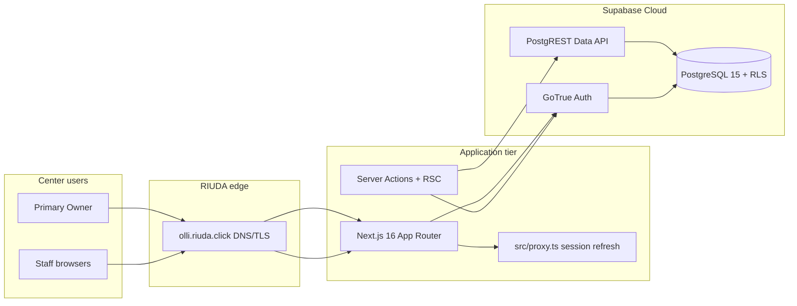

# M8 — Target Production Architecture

**Status:** Implemented (M8-T03). Application host: **Vercel** + [`vercel.json`](../../vercel.json). Supabase Cloud unchanged.

## Intended production URL

| Surface | URL |
|---------|-----|
| **Application (canonical)** | `https://olli.riuda.click` |
| **Supabase API** | `https://<project-ref>.supabase.co` (platform default; custom Supabase domain optional later) |
| **Supabase Studio** | Operator-only; not exposed to center staff |

## Logical topology

## Component decisions

| Layer | Target | Rationale |
|-------|--------|-----------|
| **Frontend / runtime** | Single Next.js app (`npm run build` → `next start` or host-native Next adapter) | Matches [M0 web stack](../m0/23-web-stack.md); one deployable unit |
| **Hosting** | **Vercel** (Next.js 16; `vercel.json`, `npm ci` + `npm run build`) | Standard managed Next host; operator procedure [12](./12-application-deployment-operator-procedure.md) |
| **Database & Auth** | **Supabase Cloud** project (Postgres 15, Auth, PostgREST) | All business rules live in SQL migrations + RLS; local `supabase/` folder is source of truth |
| **Background workers** | **None required for MVP** | Provisioning orchestration runs synchronously in Server Actions / operator CLI |
| **Email** | Supabase Auth SMTP (transactional) | Staff `inviteUserByEmail` and future Owner invite/reset depend on configured mail |
| **Storage** | Disabled locally (`[storage] enabled = false` in `supabase/config.toml`) | No product file-upload dependency at M7 closeout |
| **CDN** | Provided by app host | Static assets via Next `_next/static` |

## Server / client boundaries (preserved)

| Concern | Location | Production rule |
|---------|----------|-----------------|
| Session refresh | `src/proxy.ts` → `src/lib/supabase/proxy.ts` | Runs on every matched request at app edge/host |
| User-scoped DB | `src/lib/supabase/server.ts` | Cookie-bound JWT; **only** pattern for authenticated reads/writes from app |
| Browser DB | `src/lib/supabase/client.ts` | Publishable key only; no secrets |
| Auth Admin / service role | `src/lib/supabase/admin.ts` (`server-only`) | **Server runtime only** — staff/center provisioning orchestration |
| Authorization | PostgreSQL RLS + RPC | Authoritative; UI redirects are UX-only (M7 contract) |
| Operator commercial RPCs | PostgREST `service_role` or `supabase db`/`psql` as RIUDA | Never exposed to browser |

## Required production services

1. **Supabase Cloud project** — linked to repo migrations (58 at M8-T01 baseline).
2. **Next.js application host** — env vars for public Supabase URL + publishable key + **server-only** `SUPABASE_SECRET_KEY`.
3. **DNS + TLS** for `olli.riuda.click` pointing at app host.
4. **SMTP** for Supabase Auth (staff invites; recommended for Owner first access).
5. **Operator secure store** for service role key (password manager / host secrets — not git).

## Non-goals (unchanged from M7)

Payment gateway, checkout, public marketing site, separate admin console UI, multi-region active-active, read replicas, custom CDN rules beyond host defaults.

## Staging recommendation

Before first customer traffic, use a **staging** Supabase project + staging hostname (e.g. `olli-staging.riuda.click`) with the **same migration chain** and **no** `seed.sql`. Production smoke (M8-T09) should run against staging first; cutover (M8-T11) promotes known-good artifact + migration revision.
